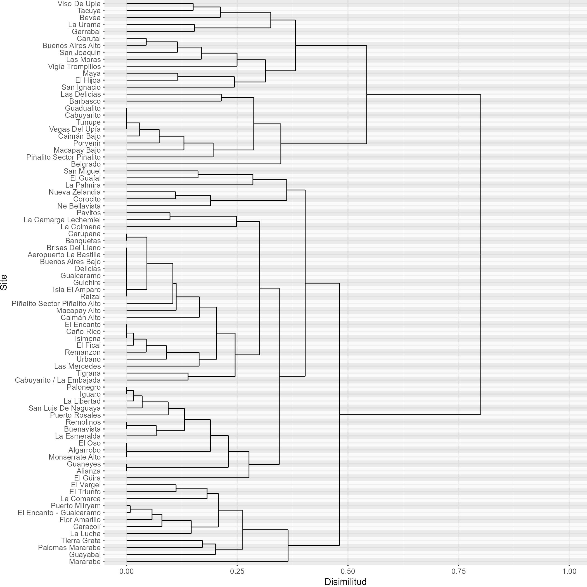
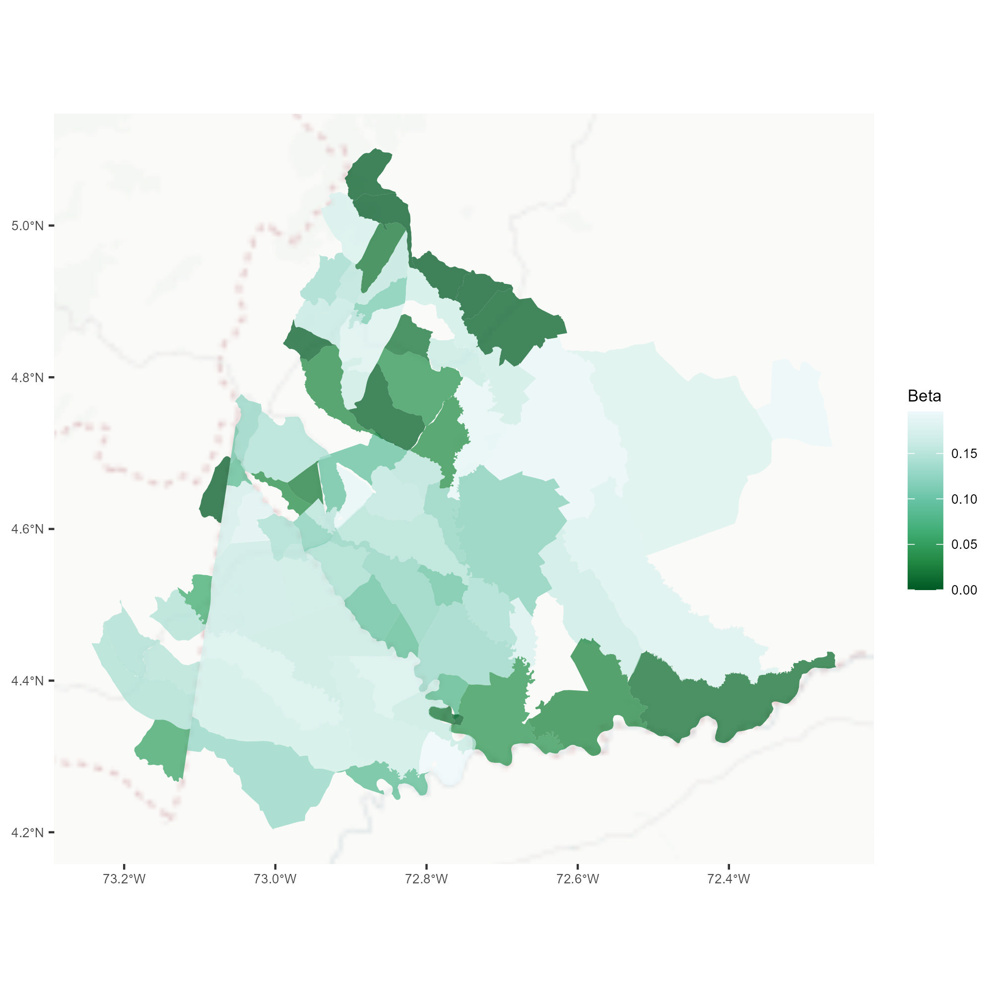

Flujo de trabajo – Análisis de diversidad Beta
================

Este flujo de trabajo estima índices de diversidad beta para un área
general y entre los sitios que la integran. Consiste en la carga y
organización de datos para la estimación de estas métricas mediante la
libreria
[vegan](https://cran.r-project.org/web/packages/vegan/vegan.pdf) en R.
La diversidad beta evalúa la variación en la composición de especies
entre diferentes sitios dentro de un área, ofreciendo una perspectiva
sobre la heterogeneidad ecológica y las diferencias en las comunidades
biológicas a través del paisaje. Se estima comparando la composición de
especies entre sitios, tomando en cuenta tanto las especies únicas
presentes en un solo sitio como las especies compartidas entre múltiples
sitios.

## Tabla de contenido

- <a href="#organizar-directorio-de-trabajo"
  id="toc-organizar-directorio-de-trabajo">Organizar directorio de
  trabajo</a>
- <a href="#establecer-parámetros-de-sesión"
  id="toc-establecer-parámetros-de-sesión">Establecer parámetros de
  sesión</a>
  - <a href="#cargar-libreriaspaquetes-necesarios-para-el-análisis"
    id="toc-cargar-libreriaspaquetes-necesarios-para-el-análisis">Cargar
    librerias/paquetes necesarios para el análisis</a>
- <a href="#establecer-entorno-de-trabajo"
  id="toc-establecer-entorno-de-trabajo">Establecer entorno de trabajo</a>
  - <a href="#definir-inputs-y-direccion-output"
    id="toc-definir-inputs-y-direccion-output">Definir inputs y direccion
    output</a>
- <a href="#organizacion-de-datos"
  id="toc-organizacion-de-datos">Organizacion de datos</a>
- <a href="#análisis-de-diversidad-beta"
  id="toc-análisis-de-diversidad-beta">Análisis de diversidad beta</a>
- <a href="#figuras-de-diversidad-beta"
  id="toc-figuras-de-diversidad-beta">Figuras de diversidad beta</a>
  - <a href="#dendograma---similitud"
    id="toc-dendograma---similitud">Dendograma - Similitud</a>
  - <a href="#representación-espacial"
    id="toc-representación-espacial">Representación espacial</a>


## Organizar directorio de trabajo

<a id="ID_seccion1"></a>

Las entradas de ejemplo de este ejercicio están almacenadas en
[IAvH/Unidades
compartidas/BetaDiversityInput/input](https://drive.google.com/drive/folders/1DGOnUX2tLY5agzcAnOmLWUPN1qKCcOJ7?usp=drive_link).
Están organizadas de esta manera que facilita la ejecución del código:

    script
    │- Bdiversity.R
    │    
    └-input
    │ │
    │ │- dataset.csv
    │ │- spatial_dataset.shp
    │     
    └-output

## Establecer parámetros de sesión

### Cargar librerias/paquetes necesarios para el análisis

``` r
## Establecer parámetros de sesión ####
### Cargar librerias/paquetes necesarios para el análisis ####

#### Verificar e instalar las librerías necesarias ####
packagesPrev <- installed.packages()[,"Package"]  
packagesNeed <- c("magrittr", "this.path", "sf", "plyr", "dplyr", "vegan", "ggspatial")  # Define los paquetes necesarios para ejecutar el codigo
new.packages <- packagesNeed[!(packagesNeed %in% packagesPrev)]  # Identifica los paquetes que no están instalados
if(length(new.packages)) {install.packages(new.packages, binary = TRUE)}  # Instala los paquetes necesarios que no están previamente instalados

#### Cargar librerías ####
lapply(packagesNeed, library, character.only = TRUE)  # Carga las librerías necesarias
```

## Establecer entorno de trabajo

El flujo de trabajo está diseñado para establecer el entorno de trabajo
automáticamente a partir de la ubicación del código. Esto significa que
tomará como “dir_work” la carpeta raiz donde se almacena el código
“\~/scripts. De esta manera, se garantiza que la ejecución se realice
bajo la misma organización descrita en el paso de [Organizar directorio
de trabajo](#ID_seccion1).

``` r
## Establecer entorno de trabajo ####
dir_work <- this.path::this.path() %>% dirname()  # Establece el directorio de trabajo
```

### Definir inputs y direccion output

Dado que el código está configurado para definir las entradas desde la
carpeta input, en esta parte se debe definir una lista llamada input en
la que se especifica el nombre de cada una de las entradas necesarias
para su ejecución. Para este ejemplo, basta con usar file.path con
referencia a “input_folder” y el nombre del archivo para definir su ruta
y facilitar su carga posterior. No obstante, se podría definir cualquier
ruta de la máquina local como carpeta input donde se almacenen las
entradas, o hacer referencia a cada archivo directamente.

Asimismo, el código genera una carpeta output donde se almacenarán los
resultados del análisis. La ruta de esa carpeta se almacena por defecto
en el mismo directorio donde se encuentra el código.

``` r
### Definir entradas necesarias para la ejecución del análisis ####

# Definir la carpeta de entrada-insumos
input_folder<- file.path(dir_work, "input"); # "~/input"

# Crear carpeta output
output<- file.path(dir_work, "output"); dir.create(output)

#### Definir entradas necesarias para la ejecución del análisis ####
input <- list(
  dataset = file.path(input_folder, "Cruce_Llanos_1.csv"), # Ruta del archivo  que contiene datos de especies por sitio
  sp_col = "species", # Nombre de la columna en el 'dataset' que contiene los nombres de las especies
  site_col = "Vereda", # Nombre de la columna en el 'dataset' que hace referencia a los sitios
  beta_plot = "j", # Nombre del indice beta con el que generar diagramas exploratorios. Por defecto es j que corresponde a Jaccard. Mas info en https://rdrr.io/rforge/vegan/man/betadiver.html
  spatial_dataset = file.path(input_folder, "Veredas_Llanos_1.shp")  # Opcional. Si no se tiene, establecer como NULL. Ruta a un archivo espacial correspondiente al área de estudio. Debe tener una columna con el mismo nombre que 'site_col' para unir el archivo espacial con los resultados
)
```

La lista de entradas incluye la ruta completa al archivo que contiene
los datos de especies por sitio, el nombre de la columna en ´dataset´
que contiene los nombres de las especies, y el nombre de la columna en
´dataset´ que hace referencia a los sitios como unidad espacial de
analisis. Este dataset se utilizará para realizar los análisis de
diversidad beta, basándose en la definición de sp_col y
site_col. Además, se especifica un argumento opcional hacia la ruta de
un archivo espacial referente a las geometrias espaciales de los sitios
definidos. Este archivo se utilizará para espacializar y diagramar los
resultados del análisis y debe tener una columna con el mismo nombre que
site_col para permitir la unión con los resultados del análisis. Si no
se dispone del archivo shapefile, este parámetro puede establecerse como
NULL.

El código estima los 24 estimadores de diversidad beta detallados en el
argumento method de
[vegan::betadiver](https://rdrr.io/rforge/vegan/man/betadiver.html),
referentes a [Koleff et
al. (2003](https://besjournals.onlinelibrary.wiley.com/doi/10.1046/j.1365-2656.2003.00710.x)
para medir la diversidad beta con datos de presencia-ausencia. Sin
embargo, se limita a diagramar para exploración los resultados para una
sola opción definida por el usuario en la entrada beta_plot. Dichas
opciones son: “j”, “w”, “-1”, “c”, “wb”, “r”, “I”, “e”, “t”, “me”,
“sor”, “m”, “-2”, “co”, “cc”, “g”, “-3”, “l”, “19”, “hk”, “rlb”, “sim”,
“gl”, “z”. Por defecto, se generan para “j”, que corresponde a
diversidad beta Jaccard. Dependiendo del método escogido, se genera un
dendrograma que muestra el agrupamiento jerárquico de los sitios basado
en su similitud o disimilitud según el índice beta utilizado. Si se
utiliza un spatial_dataset, también se puede representar espacialmente
el índice. Las opciones para beta_plot son las mismas que las
especificadas en el argumento method.

## Organizacion de datos

Los datos deben organizarse en una matriz de sitios (filas) por especies
(columnas). El código carga los datos y genera la matriz a partir de las
entradas site_col correspondiente a sitios como filas, y sp_col
correspondientes a especies como columnas.

``` r
### Generar matriz de sitios (filas) por especies (columnas) ####
original_dataset <- data.table::fread(input$dataset, header = T) %>% as.data.frame() # Lee el dataset original desde un archivo .csv
dataset_sp <- original_dataset %>% dplyr::filter(!is.na(  !!sym(input$sp_col)  ))  # Filtra los registros a nivel

data_matrix <- reshape2::dcast(dataset_sp, as.formula( paste(input$site_col, "~", input$sp_col) ), 
                               fun.aggregate = length, value.var = input$sp_col) %>% 
  tibble::column_to_rownames(input$site_col)  # Genera la matriz de sitios por especies
```

## Análisis de diversidad beta

``` r
## Análisis de diversidad beta ####
index_list<- c("w", "-1", "c", "wb", "r", "I", "e", "t", "me", "j", "sor", "m", "-2", "co", "cc", "g", "-3", "l", "19", "hk", "rlb", "sim", "gl", "z")

beta_list<- pblapply(index_list,
                     function(i) {
                       
                       # beta entre sitios #
                       disim_analysis <- betadiver(data_matrix, method = i)  # Calcula la diversidad beta entre sitios utilizando el índice i
                       beta_matrix <- as.matrix(disim_analysis)  # Convierte el análisis beta en una matriz
                       
                       # beta por sitio #
                       Bdiv_per_site <- rowMeans(beta_matrix)  # Calcula la diversidad beta por sitio como la media de la matriz
                       name_sites <- names(Bdiv_per_site) %>% as.character()  # Obtiene los nombres de los sitios
                       Bdiv_per_site_table <- as.data.frame(Bdiv_per_site) %>% tibble::rownames_to_column("site") %>% setNames(c("site", i)) # Crea una tabla con la diversidad beta por sitio
                       
                       list(Bdiv_per_site_table=Bdiv_per_site_table, beta_matrix= as.data.frame.matrix(beta_matrix) %>% tibble::rownames_to_column("site")  )
                     }) %>% setNames(index_list)

beta_matrix_list <- purrr::map(beta_list, "beta_matrix") # compilar matrices en una sola lista
beta_summ<- purrr::map(beta_list, "Bdiv_per_site_table") %>% plyr::join_all() # compilar indices alfa en una sola tabla

### Exportar tablas resultados beta ####
openxlsx::write.xlsx(beta_matrix_list, file.path(output, paste0("beta_matrix_list", ".xlsx")))
openxlsx::write.xlsx(beta_summ, file.path(output, paste0("beta_summ", ".xlsx")))

### Ver tabla indices de diversidad beta ####
print(beta_summ)
```

<table style="width:100%; height:500px; overflow-x: scroll; overflow-y: scroll;">
<thead>
<tr>
<th style="text-align:left;">
</th>
<th style="text-align:right;">
w
</th>
<th style="text-align:right;">
-1
</th>
<th style="text-align:right;">
c
</th>
<th style="text-align:right;">
wb
</th>
<th style="text-align:right;">
r
</th>
<th style="text-align:right;">
I
</th>
<th style="text-align:right;">
e
</th>
<th style="text-align:right;">
t
</th>
<th style="text-align:right;">
me
</th>
<th style="text-align:right;">
j
</th>
<th style="text-align:right;">
sor
</th>
<th style="text-align:right;">
m
</th>
<th style="text-align:right;">
-2
</th>
<th style="text-align:right;">
co
</th>
<th style="text-align:right;">
cc
</th>
<th style="text-align:right;">
g
</th>
<th style="text-align:right;">
-3
</th>
<th style="text-align:right;">
l
</th>
<th style="text-align:right;">
19
</th>
<th style="text-align:right;">
hk
</th>
<th style="text-align:right;">
rlb
</th>
<th style="text-align:right;">
sim
</th>
<th style="text-align:right;">
gl
</th>
<th style="text-align:right;">
z
</th>
</tr>
</thead>
<tbody>
<tr>
<td style="text-align:left;">
Aeropuerto La Bastilla
</td>
<td style="text-align:right;">
0.9463019
</td>
<td style="text-align:right;">
0.9463019
</td>
<td style="text-align:right;">
74.57407
</td>
<td style="text-align:right;">
149.1481
</td>
<td style="text-align:right;">
0.3360828
</td>
<td style="text-align:right;">
0.3772688
</td>
<td style="text-align:right;">
0.4802798
</td>
<td style="text-align:right;">
0.9463019
</td>
<td style="text-align:right;">
0.9463019
</td>
<td style="text-align:right;">
0.0214074
</td>
<td style="text-align:right;">
0.0413525
</td>
<td style="text-align:right;">
152.2348
</td>
<td style="text-align:right;">
0.2126985
</td>
<td style="text-align:right;">
0.8835461
</td>
<td style="text-align:right;">
0.9662469
</td>
<td style="text-align:right;">
0.9662469
</td>
<td style="text-align:right;">
0.1528801
</td>
<td style="text-align:right;">
74.57407
</td>
<td style="text-align:right;">
0.2271623
</td>
<td style="text-align:right;">
0.9463019
</td>
<td style="text-align:right;">
0.1762689
</td>
<td style="text-align:right;">
0.8044778
</td>
<td style="text-align:right;">
1.2922907
</td>
<td style="text-align:right;">
0.9573051
</td>
</tr>
<tr>
<td style="text-align:left;">
Algarrobo
</td>
<td style="text-align:right;">
0.7251360
</td>
<td style="text-align:right;">
0.7251360
</td>
<td style="text-align:right;">
109.88889
</td>
<td style="text-align:right;">
219.7778
</td>
<td style="text-align:right;">
0.2641368
</td>
<td style="text-align:right;">
0.3422801
</td>
<td style="text-align:right;">
0.4184408
</td>
<td style="text-align:right;">
0.7251360
</td>
<td style="text-align:right;">
0.7251360
</td>
<td style="text-align:right;">
0.1606498
</td>
<td style="text-align:right;">
0.2625183
</td>
<td style="text-align:right;">
256.8391
</td>
<td style="text-align:right;">
0.2523132
</td>
<td style="text-align:right;">
0.6574878
</td>
<td style="text-align:right;">
0.8270045
</td>
<td style="text-align:right;">
0.8270045
</td>
<td style="text-align:right;">
0.1827861
</td>
<td style="text-align:right;">
109.88889
</td>
<td style="text-align:right;">
0.1972034
</td>
<td style="text-align:right;">
0.7251360
</td>
<td style="text-align:right;">
0.2665227
</td>
<td style="text-align:right;">
0.5388012
</td>
<td style="text-align:right;">
0.8384014
</td>
<td style="text-align:right;">
0.7786310
</td>
</tr>
<tr>
<td style="text-align:left;">
Alianza
</td>
<td style="text-align:right;">
0.7144399
</td>
<td style="text-align:right;">
0.7144399
</td>
<td style="text-align:right;">
79.70370
</td>
<td style="text-align:right;">
159.4074
</td>
<td style="text-align:right;">
0.2555469
</td>
<td style="text-align:right;">
0.3498796
</td>
<td style="text-align:right;">
0.4275176
</td>
<td style="text-align:right;">
0.7144399
</td>
<td style="text-align:right;">
0.7144399
</td>
<td style="text-align:right;">
0.1694952
</td>
<td style="text-align:right;">
0.2732144
</td>
<td style="text-align:right;">
186.6540
</td>
<td style="text-align:right;">
0.2109754
</td>
<td style="text-align:right;">
0.6509950
</td>
<td style="text-align:right;">
0.8181591
</td>
<td style="text-align:right;">
0.8181591
</td>
<td style="text-align:right;">
0.1624409
</td>
<td style="text-align:right;">
79.70370
</td>
<td style="text-align:right;">
0.1928606
</td>
<td style="text-align:right;">
0.7144399
</td>
<td style="text-align:right;">
0.3730770
</td>
<td style="text-align:right;">
0.5240721
</td>
<td style="text-align:right;">
0.8782919
</td>
<td style="text-align:right;">
0.7687300
</td>
</tr>
<tr>
<td style="text-align:left;">
Banquetas
</td>
<td style="text-align:right;">
0.8219202
</td>
<td style="text-align:right;">
0.8219202
</td>
<td style="text-align:right;">
144.83951
</td>
<td style="text-align:right;">
289.6790
</td>
<td style="text-align:right;">
0.3630813
</td>
<td style="text-align:right;">
0.3940044
</td>
<td style="text-align:right;">
0.5007330
</td>
<td style="text-align:right;">
0.8219202
</td>
<td style="text-align:right;">
0.8219202
</td>
<td style="text-align:right;">
0.0937130
</td>
<td style="text-align:right;">
0.1657341
</td>
<td style="text-align:right;">
318.9779
</td>
<td style="text-align:right;">
0.3206583
</td>
<td style="text-align:right;">
0.7711017
</td>
<td style="text-align:right;">
0.8939413
</td>
<td style="text-align:right;">
0.8939413
</td>
<td style="text-align:right;">
0.2158049
</td>
<td style="text-align:right;">
144.83951
</td>
<td style="text-align:right;">
0.2459493
</td>
<td style="text-align:right;">
0.8219202
</td>
<td style="text-align:right;">
0.1601402
</td>
<td style="text-align:right;">
0.6870577
</td>
<td style="text-align:right;">
0.8716456
</td>
<td style="text-align:right;">
0.8606208
</td>
</tr>
<tr>
<td style="text-align:left;">
Barbasco
</td>
<td style="text-align:right;">
0.7249301
</td>
<td style="text-align:right;">
0.7249301
</td>
<td style="text-align:right;">
80.68519
</td>
<td style="text-align:right;">
161.3704
</td>
<td style="text-align:right;">
0.2666244
</td>
<td style="text-align:right;">
0.3569803
</td>
<td style="text-align:right;">
0.4378799
</td>
<td style="text-align:right;">
0.7249301
</td>
<td style="text-align:right;">
0.7249301
</td>
<td style="text-align:right;">
0.1615558
</td>
<td style="text-align:right;">
0.2627242
</td>
<td style="text-align:right;">
187.8260
</td>
<td style="text-align:right;">
0.2185498
</td>
<td style="text-align:right;">
0.6615217
</td>
<td style="text-align:right;">
0.8260985
</td>
<td style="text-align:right;">
0.8260985
</td>
<td style="text-align:right;">
0.1670231
</td>
<td style="text-align:right;">
80.68519
</td>
<td style="text-align:right;">
0.1995050
</td>
<td style="text-align:right;">
0.7249301
</td>
<td style="text-align:right;">
0.3575127
</td>
<td style="text-align:right;">
0.5366837
</td>
<td style="text-align:right;">
0.8798107
</td>
<td style="text-align:right;">
0.7780095
</td>
</tr>
<tr>
<td style="text-align:left;">
Belgrado
</td>
<td style="text-align:right;">
0.6871911
</td>
<td style="text-align:right;">
0.6871911
</td>
<td style="text-align:right;">
106.96296
</td>
<td style="text-align:right;">
213.9259
</td>
<td style="text-align:right;">
0.2219763
</td>
<td style="text-align:right;">
0.3117846
</td>
<td style="text-align:right;">
0.3764101
</td>
<td style="text-align:right;">
0.6871911
</td>
<td style="text-align:right;">
0.6871911
</td>
<td style="text-align:right;">
0.1930356
</td>
<td style="text-align:right;">
0.3004632
</td>
<td style="text-align:right;">
254.1603
</td>
<td style="text-align:right;">
0.2211644
</td>
<td style="text-align:right;">
0.6121804
</td>
<td style="text-align:right;">
0.7946188
</td>
<td style="text-align:right;">
0.7946188
</td>
<td style="text-align:right;">
0.1615430
</td>
<td style="text-align:right;">
106.96296
</td>
<td style="text-align:right;">
0.1679522
</td>
<td style="text-align:right;">
0.6871911
</td>
<td style="text-align:right;">
0.3046610
</td>
<td style="text-align:right;">
0.4795690
</td>
<td style="text-align:right;">
0.8439009
</td>
<td style="text-align:right;">
0.7429176
</td>
</tr>
<tr>
<td style="text-align:left;">
Bevea
</td>
<td style="text-align:right;">
0.7100690
</td>
<td style="text-align:right;">
0.7100690
</td>
<td style="text-align:right;">
146.11111
</td>
<td style="text-align:right;">
292.2222
</td>
<td style="text-align:right;">
0.1915190
</td>
<td style="text-align:right;">
0.2884690
</td>
<td style="text-align:right;">
0.3461640
</td>
<td style="text-align:right;">
0.7100690
</td>
<td style="text-align:right;">
0.7100690
</td>
<td style="text-align:right;">
0.1764238
</td>
<td style="text-align:right;">
0.2775853
</td>
<td style="text-align:right;">
340.9111
</td>
<td style="text-align:right;">
0.1891721
</td>
<td style="text-align:right;">
0.6058646
</td>
<td style="text-align:right;">
0.8112305
</td>
<td style="text-align:right;">
0.8112305
</td>
<td style="text-align:right;">
0.1383817
</td>
<td style="text-align:right;">
146.11111
</td>
<td style="text-align:right;">
0.1442498
</td>
<td style="text-align:right;">
0.7100690
</td>
<td style="text-align:right;">
0.2528061
</td>
<td style="text-align:right;">
0.4429339
</td>
<td style="text-align:right;">
0.9644916
</td>
<td style="text-align:right;">
0.7627407
</td>
</tr>
<tr>
<td style="text-align:left;">
Brisas Del Llano
</td>
<td style="text-align:right;">
0.9775476
</td>
<td style="text-align:right;">
0.9775476
</td>
<td style="text-align:right;">
72.16667
</td>
<td style="text-align:right;">
144.3333
</td>
<td style="text-align:right;">
0.2679420
</td>
<td style="text-align:right;">
0.3031005
</td>
<td style="text-align:right;">
0.3808053
</td>
<td style="text-align:right;">
0.9775476
</td>
<td style="text-align:right;">
0.9775476
</td>
<td style="text-align:right;">
0.0052465
</td>
<td style="text-align:right;">
0.0101067
</td>
<td style="text-align:right;">
145.0278
</td>
<td style="text-align:right;">
0.1746413
</td>
<td style="text-align:right;">
0.9395472
</td>
<td style="text-align:right;">
0.9824079
</td>
<td style="text-align:right;">
0.9824079
</td>
<td style="text-align:right;">
0.1220315
</td>
<td style="text-align:right;">
72.16667
</td>
<td style="text-align:right;">
0.1865104
</td>
<td style="text-align:right;">
0.9775476
</td>
<td style="text-align:right;">
0.0821238
</td>
<td style="text-align:right;">
0.8979277
</td>
<td style="text-align:right;">
1.4700660
</td>
<td style="text-align:right;">
0.9802277
</td>
</tr>
<tr>
<td style="text-align:left;">
Buenavista
</td>
<td style="text-align:right;">
0.8017656
</td>
<td style="text-align:right;">
0.8017656
</td>
<td style="text-align:right;">
78.67284
</td>
<td style="text-align:right;">
157.3457
</td>
<td style="text-align:right;">
0.3206638
</td>
<td style="text-align:right;">
0.3943551
</td>
<td style="text-align:right;">
0.4935032
</td>
<td style="text-align:right;">
0.8017656
</td>
<td style="text-align:right;">
0.8017656
</td>
<td style="text-align:right;">
0.1076050
</td>
<td style="text-align:right;">
0.1858887
</td>
<td style="text-align:right;">
174.8543
</td>
<td style="text-align:right;">
0.2533787
</td>
<td style="text-align:right;">
0.7402450
</td>
<td style="text-align:right;">
0.8800493
</td>
<td style="text-align:right;">
0.8800493
</td>
<td style="text-align:right;">
0.1834664
</td>
<td style="text-align:right;">
78.67284
</td>
<td style="text-align:right;">
0.2294728
</td>
<td style="text-align:right;">
0.8017656
</td>
<td style="text-align:right;">
0.3074593
</td>
<td style="text-align:right;">
0.6319617
</td>
<td style="text-align:right;">
0.9463014
</td>
<td style="text-align:right;">
0.8435697
</td>
</tr>
<tr>
<td style="text-align:left;">
Buenos Aires Alto
</td>
<td style="text-align:right;">
0.7739675
</td>
<td style="text-align:right;">
0.7739675
</td>
<td style="text-align:right;">
209.24691
</td>
<td style="text-align:right;">
418.4938
</td>
<td style="text-align:right;">
0.1836809
</td>
<td style="text-align:right;">
0.2863000
</td>
<td style="text-align:right;">
0.3430964
</td>
<td style="text-align:right;">
0.7739675
</td>
<td style="text-align:right;">
0.7739675
</td>
<td style="text-align:right;">
0.1280672
</td>
<td style="text-align:right;">
0.2136868
</td>
<td style="text-align:right;">
471.5340
</td>
<td style="text-align:right;">
0.1515245
</td>
<td style="text-align:right;">
0.6540972
</td>
<td style="text-align:right;">
0.8595871
</td>
<td style="text-align:right;">
0.8595871
</td>
<td style="text-align:right;">
0.1180931
</td>
<td style="text-align:right;">
209.24691
</td>
<td style="text-align:right;">
0.1429506
</td>
<td style="text-align:right;">
0.7739675
</td>
<td style="text-align:right;">
0.1928562
</td>
<td style="text-align:right;">
0.4774512
</td>
<td style="text-align:right;">
1.1482081
</td>
<td style="text-align:right;">
0.8192634
</td>
</tr>
<tr>
<td style="text-align:left;">
Buenos Aires Bajo
</td>
<td style="text-align:right;">
0.8445826
</td>
<td style="text-align:right;">
0.8445826
</td>
<td style="text-align:right;">
86.69136
</td>
<td style="text-align:right;">
173.3827
</td>
<td style="text-align:right;">
0.3889198
</td>
<td style="text-align:right;">
0.4310693
</td>
<td style="text-align:right;">
0.5503067
</td>
<td style="text-align:right;">
0.8445826
</td>
<td style="text-align:right;">
0.8445826
</td>
<td style="text-align:right;">
0.0791342
</td>
<td style="text-align:right;">
0.1430717
</td>
<td style="text-align:right;">
188.5024
</td>
<td style="text-align:right;">
0.2976363
</td>
<td style="text-align:right;">
0.7987635
</td>
<td style="text-align:right;">
0.9085201
</td>
<td style="text-align:right;">
0.9085201
</td>
<td style="text-align:right;">
0.2094527
</td>
<td style="text-align:right;">
86.69136
</td>
<td style="text-align:right;">
0.2666149
</td>
<td style="text-align:right;">
0.8445826
</td>
<td style="text-align:right;">
0.2195127
</td>
<td style="text-align:right;">
0.7162715
</td>
<td style="text-align:right;">
0.9192785
</td>
<td style="text-align:right;">
0.8791704
</td>
</tr>
<tr>
<td style="text-align:left;">
Cabuyarito
</td>
<td style="text-align:right;">
0.8764227
</td>
<td style="text-align:right;">
0.8764227
</td>
<td style="text-align:right;">
74.68519
</td>
<td style="text-align:right;">
149.3704
</td>
<td style="text-align:right;">
0.3275857
</td>
<td style="text-align:right;">
0.3920486
</td>
<td style="text-align:right;">
0.4960187
</td>
<td style="text-align:right;">
0.8764227
</td>
<td style="text-align:right;">
0.8764227
</td>
<td style="text-align:right;">
0.0603368
</td>
<td style="text-align:right;">
0.1112316
</td>
<td style="text-align:right;">
158.5079
</td>
<td style="text-align:right;">
0.2204741
</td>
<td style="text-align:right;">
0.7852995
</td>
<td style="text-align:right;">
0.9273176
</td>
<td style="text-align:right;">
0.9273176
</td>
<td style="text-align:right;">
0.1608822
</td>
<td style="text-align:right;">
74.68519
</td>
<td style="text-align:right;">
0.2255631
</td>
<td style="text-align:right;">
0.8764227
</td>
<td style="text-align:right;">
0.2747102
</td>
<td style="text-align:right;">
0.6559710
</td>
<td style="text-align:right;">
1.1442740
</td>
<td style="text-align:right;">
0.9041169
</td>
</tr>
<tr>
<td style="text-align:left;">
Cabuyarito / La Embajada
</td>
<td style="text-align:right;">
0.7260866
</td>
<td style="text-align:right;">
0.7260866
</td>
<td style="text-align:right;">
129.63580
</td>
<td style="text-align:right;">
259.2716
</td>
<td style="text-align:right;">
0.2377993
</td>
<td style="text-align:right;">
0.3210101
</td>
<td style="text-align:right;">
0.3895235
</td>
<td style="text-align:right;">
0.7260866
</td>
<td style="text-align:right;">
0.7260866
</td>
<td style="text-align:right;">
0.1626998
</td>
<td style="text-align:right;">
0.2615677
</td>
<td style="text-align:right;">
301.7757
</td>
<td style="text-align:right;">
0.2333866
</td>
<td style="text-align:right;">
0.6485575
</td>
<td style="text-align:right;">
0.8249545
</td>
<td style="text-align:right;">
0.8249545
</td>
<td style="text-align:right;">
0.1696179
</td>
<td style="text-align:right;">
129.63580
</td>
<td style="text-align:right;">
0.1795634
</td>
<td style="text-align:right;">
0.7260866
</td>
<td style="text-align:right;">
0.2671772
</td>
<td style="text-align:right;">
0.5221187
</td>
<td style="text-align:right;">
0.8894374
</td>
<td style="text-align:right;">
0.7778634
</td>
</tr>
<tr>
<td style="text-align:left;">
Caimán Alto
</td>
<td style="text-align:right;">
0.7572393
</td>
<td style="text-align:right;">
0.7572393
</td>
<td style="text-align:right;">
119.05556
</td>
<td style="text-align:right;">
238.1111
</td>
<td style="text-align:right;">
0.2965988
</td>
<td style="text-align:right;">
0.3614060
</td>
<td style="text-align:right;">
0.4470185
</td>
<td style="text-align:right;">
0.7572393
</td>
<td style="text-align:right;">
0.7572393
</td>
<td style="text-align:right;">
0.1366933
</td>
<td style="text-align:right;">
0.2304151
</td>
<td style="text-align:right;">
273.2398
</td>
<td style="text-align:right;">
0.2788301
</td>
<td style="text-align:right;">
0.6956877
</td>
<td style="text-align:right;">
0.8509610
</td>
<td style="text-align:right;">
0.8509610
</td>
<td style="text-align:right;">
0.1970211
</td>
<td style="text-align:right;">
119.05556
</td>
<td style="text-align:right;">
0.2157086
</td>
<td style="text-align:right;">
0.7572393
</td>
<td style="text-align:right;">
0.2407547
</td>
<td style="text-align:right;">
0.5897126
</td>
<td style="text-align:right;">
0.8416065
</td>
<td style="text-align:right;">
0.8068792
</td>
</tr>
<tr>
<td style="text-align:left;">
Caimán Bajo
</td>
<td style="text-align:right;">
0.8237745
</td>
<td style="text-align:right;">
0.8237745
</td>
<td style="text-align:right;">
166.70988
</td>
<td style="text-align:right;">
333.4198
</td>
<td style="text-align:right;">
0.3290303
</td>
<td style="text-align:right;">
0.3731038
</td>
<td style="text-align:right;">
0.4693261
</td>
<td style="text-align:right;">
0.8237745
</td>
<td style="text-align:right;">
0.8237745
</td>
<td style="text-align:right;">
0.0934964
</td>
<td style="text-align:right;">
0.1638799
</td>
<td style="text-align:right;">
367.2107
</td>
<td style="text-align:right;">
0.2883591
</td>
<td style="text-align:right;">
0.7683556
</td>
<td style="text-align:right;">
0.8941579
</td>
<td style="text-align:right;">
0.8941579
</td>
<td style="text-align:right;">
0.1986753
</td>
<td style="text-align:right;">
166.70988
</td>
<td style="text-align:right;">
0.2291472
</td>
<td style="text-align:right;">
0.8237745
</td>
<td style="text-align:right;">
0.1649804
</td>
<td style="text-align:right;">
0.6806165
</td>
<td style="text-align:right;">
0.9423061
</td>
<td style="text-align:right;">
0.8615227
</td>
</tr>
<tr>
<td style="text-align:left;">
Caño Rico
</td>
<td style="text-align:right;">
0.9107284
</td>
<td style="text-align:right;">
0.9107284
</td>
<td style="text-align:right;">
69.86420
</td>
<td style="text-align:right;">
139.7284
</td>
<td style="text-align:right;">
0.2721814
</td>
<td style="text-align:right;">
0.3312129
</td>
<td style="text-align:right;">
0.4190445
</td>
<td style="text-align:right;">
0.9107284
</td>
<td style="text-align:right;">
0.9107284
</td>
<td style="text-align:right;">
0.0409480
</td>
<td style="text-align:right;">
0.0769259
</td>
<td style="text-align:right;">
145.7964
</td>
<td style="text-align:right;">
0.1804644
</td>
<td style="text-align:right;">
0.7513226
</td>
<td style="text-align:right;">
0.9467063
</td>
<td style="text-align:right;">
0.9467063
</td>
<td style="text-align:right;">
0.1250198
</td>
<td style="text-align:right;">
69.86420
</td>
<td style="text-align:right;">
0.1797925
</td>
<td style="text-align:right;">
0.9107284
</td>
<td style="text-align:right;">
0.3442961
</td>
<td style="text-align:right;">
0.5596708
</td>
<td style="text-align:right;">
1.3329194
</td>
<td style="text-align:right;">
0.9304150
</td>
</tr>
<tr>
<td style="text-align:left;">
Caracolí
</td>
<td style="text-align:right;">
0.7911101
</td>
<td style="text-align:right;">
0.7911101
</td>
<td style="text-align:right;">
190.78395
</td>
<td style="text-align:right;">
381.5679
</td>
<td style="text-align:right;">
0.2397412
</td>
<td style="text-align:right;">
0.3202091
</td>
<td style="text-align:right;">
0.3922896
</td>
<td style="text-align:right;">
0.7911101
</td>
<td style="text-align:right;">
0.7911101
</td>
<td style="text-align:right;">
0.1148015
</td>
<td style="text-align:right;">
0.1965443
</td>
<td style="text-align:right;">
426.6481
</td>
<td style="text-align:right;">
0.2056269
</td>
<td style="text-align:right;">
0.6924723
</td>
<td style="text-align:right;">
0.8728528
</td>
<td style="text-align:right;">
0.8728528
</td>
<td style="text-align:right;">
0.1502286
</td>
<td style="text-align:right;">
190.78395
</td>
<td style="text-align:right;">
0.1758165
</td>
<td style="text-align:right;">
0.7911101
</td>
<td style="text-align:right;">
0.2047338
</td>
<td style="text-align:right;">
0.5455581
</td>
<td style="text-align:right;">
1.0627616
</td>
<td style="text-align:right;">
0.8346361
</td>
</tr>
<tr>
<td style="text-align:left;">
Carupana
</td>
<td style="text-align:right;">
0.9603989
</td>
<td style="text-align:right;">
0.9603989
</td>
<td style="text-align:right;">
74.54938
</td>
<td style="text-align:right;">
149.0988
</td>
<td style="text-align:right;">
0.3385169
</td>
<td style="text-align:right;">
0.3732541
</td>
<td style="text-align:right;">
0.4759914
</td>
<td style="text-align:right;">
0.9603989
</td>
<td style="text-align:right;">
0.9603989
</td>
<td style="text-align:right;">
0.0139754
</td>
<td style="text-align:right;">
0.0272554
</td>
<td style="text-align:right;">
151.2729
</td>
<td style="text-align:right;">
0.2131880
</td>
<td style="text-align:right;">
0.9098351
</td>
<td style="text-align:right;">
0.9736789
</td>
<td style="text-align:right;">
0.9736789
</td>
<td style="text-align:right;">
0.1524061
</td>
<td style="text-align:right;">
74.54938
</td>
<td style="text-align:right;">
0.2278058
</td>
<td style="text-align:right;">
0.9603989
</td>
<td style="text-align:right;">
0.1158248
</td>
<td style="text-align:right;">
0.8485359
</td>
<td style="text-align:right;">
1.3184950
</td>
<td style="text-align:right;">
0.9677455
</td>
</tr>
<tr>
<td style="text-align:left;">
Carutal
</td>
<td style="text-align:right;">
0.8365101
</td>
<td style="text-align:right;">
0.8365101
</td>
<td style="text-align:right;">
76.70370
</td>
<td style="text-align:right;">
153.4074
</td>
<td style="text-align:right;">
0.3226910
</td>
<td style="text-align:right;">
0.3957773
</td>
<td style="text-align:right;">
0.4966917
</td>
<td style="text-align:right;">
0.8365101
</td>
<td style="text-align:right;">
0.8365101
</td>
<td style="text-align:right;">
0.0850400
</td>
<td style="text-align:right;">
0.1511442
</td>
<td style="text-align:right;">
166.0585
</td>
<td style="text-align:right;">
0.2325100
</td>
<td style="text-align:right;">
0.7638794
</td>
<td style="text-align:right;">
0.9026143
</td>
<td style="text-align:right;">
0.9026143
</td>
<td style="text-align:right;">
0.1719424
</td>
<td style="text-align:right;">
76.70370
</td>
<td style="text-align:right;">
0.2292428
</td>
<td style="text-align:right;">
0.8365101
</td>
<td style="text-align:right;">
0.2685675
</td>
<td style="text-align:right;">
0.6478775
</td>
<td style="text-align:right;">
1.0433048
</td>
<td style="text-align:right;">
0.8721125
</td>
</tr>
<tr>
<td style="text-align:left;">
Corocito
</td>
<td style="text-align:right;">
0.7600034
</td>
<td style="text-align:right;">
0.7600034
</td>
<td style="text-align:right;">
159.01235
</td>
<td style="text-align:right;">
318.0247
</td>
<td style="text-align:right;">
0.2395413
</td>
<td style="text-align:right;">
0.3215373
</td>
<td style="text-align:right;">
0.3914099
</td>
<td style="text-align:right;">
0.7600034
</td>
<td style="text-align:right;">
0.7600034
</td>
<td style="text-align:right;">
0.1370761
</td>
<td style="text-align:right;">
0.2276509
</td>
<td style="text-align:right;">
362.5626
</td>
<td style="text-align:right;">
0.2241277
</td>
<td style="text-align:right;">
0.6797940
</td>
<td style="text-align:right;">
0.8505782
</td>
<td style="text-align:right;">
0.8505782
</td>
<td style="text-align:right;">
0.1628219
</td>
<td style="text-align:right;">
159.01235
</td>
<td style="text-align:right;">
0.1794783
</td>
<td style="text-align:right;">
0.7600034
</td>
<td style="text-align:right;">
0.2407120
</td>
<td style="text-align:right;">
0.5524007
</td>
<td style="text-align:right;">
0.9706805
</td>
<td style="text-align:right;">
0.8078351
</td>
</tr>
<tr>
<td style="text-align:left;">
Delicias
</td>
<td style="text-align:right;">
0.9857937
</td>
<td style="text-align:right;">
0.9857937
</td>
<td style="text-align:right;">
72.68519
</td>
<td style="text-align:right;">
145.3704
</td>
<td style="text-align:right;">
0.2792853
</td>
<td style="text-align:right;">
0.3088162
</td>
<td style="text-align:right;">
0.3893719
</td>
<td style="text-align:right;">
0.9857937
</td>
<td style="text-align:right;">
0.9857937
</td>
<td style="text-align:right;">
0.0009425
</td>
<td style="text-align:right;">
0.0018606
</td>
<td style="text-align:right;">
145.5533
</td>
<td style="text-align:right;">
0.1801493
</td>
<td style="text-align:right;">
0.9755904
</td>
<td style="text-align:right;">
0.9867119
</td>
<td style="text-align:right;">
0.9867119
</td>
<td style="text-align:right;">
0.1254150
</td>
<td style="text-align:right;">
72.68519
</td>
<td style="text-align:right;">
0.1927540
</td>
<td style="text-align:right;">
0.9857937
</td>
<td style="text-align:right;">
0.0231481
</td>
<td style="text-align:right;">
0.9645062
</td>
<td style="text-align:right;">
1.4700660
</td>
<td style="text-align:right;">
0.9863034
</td>
</tr>
<tr>
<td style="text-align:left;">
El Encanto
</td>
<td style="text-align:right;">
0.9250665
</td>
<td style="text-align:right;">
0.9250665
</td>
<td style="text-align:right;">
69.04938
</td>
<td style="text-align:right;">
138.0988
</td>
<td style="text-align:right;">
0.2211597
</td>
<td style="text-align:right;">
0.2805492
</td>
<td style="text-align:right;">
0.3507136
</td>
<td style="text-align:right;">
0.9250665
</td>
<td style="text-align:right;">
0.9250665
</td>
<td style="text-align:right;">
0.0329627
</td>
<td style="text-align:right;">
0.0625878
</td>
<td style="text-align:right;">
142.2364
</td>
<td style="text-align:right;">
0.1544974
</td>
<td style="text-align:right;">
0.7290655
</td>
<td style="text-align:right;">
0.9546916
</td>
<td style="text-align:right;">
0.9546916
</td>
<td style="text-align:right;">
0.1045485
</td>
<td style="text-align:right;">
69.04938
</td>
<td style="text-align:right;">
0.1503447
</td>
<td style="text-align:right;">
0.9250665
</td>
<td style="text-align:right;">
0.3714603
</td>
<td style="text-align:right;">
0.5074466
</td>
<td style="text-align:right;">
1.4425759
</td>
<td style="text-align:right;">
0.9413298
</td>
</tr>
<tr>
<td style="text-align:left;">
El Encanto - Guaicaramo
</td>
<td style="text-align:right;">
0.8118351
</td>
<td style="text-align:right;">
0.8118351
</td>
<td style="text-align:right;">
73.47531
</td>
<td style="text-align:right;">
146.9506
</td>
<td style="text-align:right;">
0.2918674
</td>
<td style="text-align:right;">
0.3768082
</td>
<td style="text-align:right;">
0.4699364
</td>
<td style="text-align:right;">
0.8118351
</td>
<td style="text-align:right;">
0.8118351
</td>
<td style="text-align:right;">
0.1009630
</td>
<td style="text-align:right;">
0.1758192
</td>
<td style="text-align:right;">
161.6251
</td>
<td style="text-align:right;">
0.2134934
</td>
<td style="text-align:right;">
0.7201675
</td>
<td style="text-align:right;">
0.8866914
</td>
<td style="text-align:right;">
0.8866914
</td>
<td style="text-align:right;">
0.1577181
</td>
<td style="text-align:right;">
73.47531
</td>
<td style="text-align:right;">
0.2076301
</td>
<td style="text-align:right;">
0.8118351
</td>
<td style="text-align:right;">
0.3254227
</td>
<td style="text-align:right;">
0.5760860
</td>
<td style="text-align:right;">
1.0501275
</td>
<td style="text-align:right;">
0.8519098
</td>
</tr>
<tr>
<td style="text-align:left;">
El Fical
</td>
<td style="text-align:right;">
0.8336140
</td>
<td style="text-align:right;">
0.8336140
</td>
<td style="text-align:right;">
128.38272
</td>
<td style="text-align:right;">
256.7654
</td>
<td style="text-align:right;">
0.3991278
</td>
<td style="text-align:right;">
0.4181485
</td>
<td style="text-align:right;">
0.5356380
</td>
<td style="text-align:right;">
0.8336140
</td>
<td style="text-align:right;">
0.8336140
</td>
<td style="text-align:right;">
0.0864176
</td>
<td style="text-align:right;">
0.1540404
</td>
<td style="text-align:right;">
281.8721
</td>
<td style="text-align:right;">
0.3386871
</td>
<td style="text-align:right;">
0.7984533
</td>
<td style="text-align:right;">
0.9012367
</td>
<td style="text-align:right;">
0.9012367
</td>
<td style="text-align:right;">
0.2299346
</td>
<td style="text-align:right;">
128.38272
</td>
<td style="text-align:right;">
0.2681987
</td>
<td style="text-align:right;">
0.8336140
</td>
<td style="text-align:right;">
0.1733683
</td>
<td style="text-align:right;">
0.7339764
</td>
<td style="text-align:right;">
0.8379009
</td>
<td style="text-align:right;">
0.8700463
</td>
</tr>
<tr>
<td style="text-align:left;">
El Guafal
</td>
<td style="text-align:right;">
0.7303733
</td>
<td style="text-align:right;">
0.7303733
</td>
<td style="text-align:right;">
73.41358
</td>
<td style="text-align:right;">
146.8272
</td>
<td style="text-align:right;">
0.2482329
</td>
<td style="text-align:right;">
0.3498470
</td>
<td style="text-align:right;">
0.4279955
</td>
<td style="text-align:right;">
0.7303733
</td>
<td style="text-align:right;">
0.7303733
</td>
<td style="text-align:right;">
0.1582382
</td>
<td style="text-align:right;">
0.2572810
</td>
<td style="text-align:right;">
169.4732
</td>
<td style="text-align:right;">
0.2064946
</td>
<td style="text-align:right;">
0.6479700
</td>
<td style="text-align:right;">
0.8294161
</td>
<td style="text-align:right;">
0.8294161
</td>
<td style="text-align:right;">
0.1556915
</td>
<td style="text-align:right;">
73.41358
</td>
<td style="text-align:right;">
0.1858499
</td>
<td style="text-align:right;">
0.7303733
</td>
<td style="text-align:right;">
0.3745899
</td>
<td style="text-align:right;">
0.5032661
</td>
<td style="text-align:right;">
0.9265020
</td>
<td style="text-align:right;">
0.7824348
</td>
</tr>
<tr>
<td style="text-align:left;">
El Güira
</td>
<td style="text-align:right;">
0.6891607
</td>
<td style="text-align:right;">
0.6891607
</td>
<td style="text-align:right;">
125.35802
</td>
<td style="text-align:right;">
250.7160
</td>
<td style="text-align:right;">
0.1933414
</td>
<td style="text-align:right;">
0.2919068
</td>
<td style="text-align:right;">
0.3483056
</td>
<td style="text-align:right;">
0.6891607
</td>
<td style="text-align:right;">
0.6891607
</td>
<td style="text-align:right;">
0.1912785
</td>
<td style="text-align:right;">
0.2984936
</td>
<td style="text-align:right;">
297.3476
</td>
<td style="text-align:right;">
0.1987695
</td>
<td style="text-align:right;">
0.5967427
</td>
<td style="text-align:right;">
0.7963758
</td>
<td style="text-align:right;">
0.7963758
</td>
<td style="text-align:right;">
0.1479476
</td>
<td style="text-align:right;">
125.35802
</td>
<td style="text-align:right;">
0.1501421
</td>
<td style="text-align:right;">
0.6891607
</td>
<td style="text-align:right;">
0.3399850
</td>
<td style="text-align:right;">
0.4470472
</td>
<td style="text-align:right;">
0.9013599
</td>
<td style="text-align:right;">
0.7448025
</td>
</tr>
<tr>
<td style="text-align:left;">
El Hijoa
</td>
<td style="text-align:right;">
0.7323304
</td>
<td style="text-align:right;">
0.7323304
</td>
<td style="text-align:right;">
184.13580
</td>
<td style="text-align:right;">
368.2716
</td>
<td style="text-align:right;">
0.1570911
</td>
<td style="text-align:right;">
0.2691068
</td>
<td style="text-align:right;">
0.3183196
</td>
<td style="text-align:right;">
0.7323304
</td>
<td style="text-align:right;">
0.7323304
</td>
<td style="text-align:right;">
0.1586263
</td>
<td style="text-align:right;">
0.2553239
</td>
<td style="text-align:right;">
424.5796
</td>
<td style="text-align:right;">
0.1410684
</td>
<td style="text-align:right;">
0.6014932
</td>
<td style="text-align:right;">
0.8290280
</td>
<td style="text-align:right;">
0.8290280
</td>
<td style="text-align:right;">
0.1104525
</td>
<td style="text-align:right;">
184.13580
</td>
<td style="text-align:right;">
0.1250224
</td>
<td style="text-align:right;">
0.7323304
</td>
<td style="text-align:right;">
0.3134567
</td>
<td style="text-align:right;">
0.4067625
</td>
<td style="text-align:right;">
1.1029977
</td>
<td style="text-align:right;">
0.7829696
</td>
</tr>
<tr>
<td style="text-align:left;">
El Oso
</td>
<td style="text-align:right;">
0.9871024
</td>
<td style="text-align:right;">
0.9871024
</td>
<td style="text-align:right;">
75.25926
</td>
<td style="text-align:right;">
150.5185
</td>
<td style="text-align:right;">
0.3450559
</td>
<td style="text-align:right;">
0.3671822
</td>
<td style="text-align:right;">
0.4688556
</td>
<td style="text-align:right;">
0.9871024
</td>
<td style="text-align:right;">
0.9871024
</td>
<td style="text-align:right;">
0.0002782
</td>
<td style="text-align:right;">
0.0005519
</td>
<td style="text-align:right;">
150.5676
</td>
<td style="text-align:right;">
0.2146784
</td>
<td style="text-align:right;">
0.9856002
</td>
<td style="text-align:right;">
0.9873761
</td>
<td style="text-align:right;">
0.9873761
</td>
<td style="text-align:right;">
0.1523995
</td>
<td style="text-align:right;">
75.25926
</td>
<td style="text-align:right;">
0.2318121
</td>
<td style="text-align:right;">
0.9871024
</td>
<td style="text-align:right;">
0.0021023
</td>
<td style="text-align:right;">
0.9838557
</td>
<td style="text-align:right;">
1.3647156
</td>
<td style="text-align:right;">
0.9872546
</td>
</tr>
<tr>
<td style="text-align:left;">
El Triunfo
</td>
<td style="text-align:right;">
0.7432077
</td>
<td style="text-align:right;">
0.7432077
</td>
<td style="text-align:right;">
72.51235
</td>
<td style="text-align:right;">
145.0247
</td>
<td style="text-align:right;">
0.2525298
</td>
<td style="text-align:right;">
0.3537658
</td>
<td style="text-align:right;">
0.4339155
</td>
<td style="text-align:right;">
0.7432077
</td>
<td style="text-align:right;">
0.7432077
</td>
<td style="text-align:right;">
0.1478230
</td>
<td style="text-align:right;">
0.2444466
</td>
<td style="text-align:right;">
166.4679
</td>
<td style="text-align:right;">
0.2101101
</td>
<td style="text-align:right;">
0.6574398
</td>
<td style="text-align:right;">
0.8398313
</td>
<td style="text-align:right;">
0.8398313
</td>
<td style="text-align:right;">
0.1557563
</td>
<td style="text-align:right;">
72.51235
</td>
<td style="text-align:right;">
0.1871080
</td>
<td style="text-align:right;">
0.7432077
</td>
<td style="text-align:right;">
0.3564491
</td>
<td style="text-align:right;">
0.5096199
</td>
<td style="text-align:right;">
0.9463014
</td>
<td style="text-align:right;">
0.7941650
</td>
</tr>
<tr>
<td style="text-align:left;">
El Vergel
</td>
<td style="text-align:right;">
0.7752223
</td>
<td style="text-align:right;">
0.7752223
</td>
<td style="text-align:right;">
164.82099
</td>
<td style="text-align:right;">
329.6420
</td>
<td style="text-align:right;">
0.2545277
</td>
<td style="text-align:right;">
0.3301627
</td>
<td style="text-align:right;">
0.4048717
</td>
<td style="text-align:right;">
0.7752223
</td>
<td style="text-align:right;">
0.7752223
</td>
<td style="text-align:right;">
0.1258724
</td>
<td style="text-align:right;">
0.2124320
</td>
<td style="text-align:right;">
372.5968
</td>
<td style="text-align:right;">
0.2327574
</td>
<td style="text-align:right;">
0.6907432
</td>
<td style="text-align:right;">
0.8617819
</td>
<td style="text-align:right;">
0.8617819
</td>
<td style="text-align:right;">
0.1673446
</td>
<td style="text-align:right;">
164.82099
</td>
<td style="text-align:right;">
0.1870329
</td>
<td style="text-align:right;">
0.7752223
</td>
<td style="text-align:right;">
0.2519855
</td>
<td style="text-align:right;">
0.5611332
</td>
<td style="text-align:right;">
0.9786573
</td>
<td style="text-align:right;">
0.8211345
</td>
</tr>
<tr>
<td style="text-align:left;">
Flor Amarillo
</td>
<td style="text-align:right;">
0.8190611
</td>
<td style="text-align:right;">
0.8190611
</td>
<td style="text-align:right;">
109.22840
</td>
<td style="text-align:right;">
218.4568
</td>
<td style="text-align:right;">
0.3928540
</td>
<td style="text-align:right;">
0.4197432
</td>
<td style="text-align:right;">
0.5364402
</td>
<td style="text-align:right;">
0.8190611
</td>
<td style="text-align:right;">
0.8190611
</td>
<td style="text-align:right;">
0.0968231
</td>
<td style="text-align:right;">
0.1685932
</td>
<td style="text-align:right;">
242.0318
</td>
<td style="text-align:right;">
0.3178463
</td>
<td style="text-align:right;">
0.7827018
</td>
<td style="text-align:right;">
0.8908312
</td>
<td style="text-align:right;">
0.8908312
</td>
<td style="text-align:right;">
0.2224136
</td>
<td style="text-align:right;">
109.22840
</td>
<td style="text-align:right;">
0.2665456
</td>
<td style="text-align:right;">
0.8190611
</td>
<td style="text-align:right;">
0.1920085
</td>
<td style="text-align:right;">
0.7114877
</td>
<td style="text-align:right;">
0.8378215
</td>
<td style="text-align:right;">
0.8575013
</td>
</tr>
<tr>
<td style="text-align:left;">
Garrabal
</td>
<td style="text-align:right;">
0.7354112
</td>
<td style="text-align:right;">
0.7354112
</td>
<td style="text-align:right;">
82.81481
</td>
<td style="text-align:right;">
165.6296
</td>
<td style="text-align:right;">
0.2780887
</td>
<td style="text-align:right;">
0.3644158
</td>
<td style="text-align:right;">
0.4483325
</td>
<td style="text-align:right;">
0.7354112
</td>
<td style="text-align:right;">
0.7354112
</td>
<td style="text-align:right;">
0.1532506
</td>
<td style="text-align:right;">
0.2522432
</td>
<td style="text-align:right;">
191.3310
</td>
<td style="text-align:right;">
0.2269302
</td>
<td style="text-align:right;">
0.6728639
</td>
<td style="text-align:right;">
0.8344037
</td>
<td style="text-align:right;">
0.8344037
</td>
<td style="text-align:right;">
0.1731776
</td>
<td style="text-align:right;">
82.81481
</td>
<td style="text-align:right;">
0.2076126
</td>
<td style="text-align:right;">
0.7354112
</td>
<td style="text-align:right;">
0.3162013
</td>
<td style="text-align:right;">
0.5518552
</td>
<td style="text-align:right;">
0.8782919
</td>
<td style="text-align:right;">
0.7875218
</td>
</tr>
<tr>
<td style="text-align:left;">
Guadualito
</td>
<td style="text-align:right;">
0.9530583
</td>
<td style="text-align:right;">
0.9530583
</td>
<td style="text-align:right;">
70.43210
</td>
<td style="text-align:right;">
140.8642
</td>
<td style="text-align:right;">
0.2194928
</td>
<td style="text-align:right;">
0.2706187
</td>
<td style="text-align:right;">
0.3360131
</td>
<td style="text-align:right;">
0.9530583
</td>
<td style="text-align:right;">
0.9530583
</td>
<td style="text-align:right;">
0.0180905
</td>
<td style="text-align:right;">
0.0345961
</td>
<td style="text-align:right;">
142.7719
</td>
<td style="text-align:right;">
0.1442719
</td>
<td style="text-align:right;">
0.8366328
</td>
<td style="text-align:right;">
0.9695638
</td>
<td style="text-align:right;">
0.9695638
</td>
<td style="text-align:right;">
0.1027125
</td>
<td style="text-align:right;">
70.43210
</td>
<td style="text-align:right;">
0.1567584
</td>
<td style="text-align:right;">
0.9530583
</td>
<td style="text-align:right;">
0.1838819
</td>
<td style="text-align:right;">
0.7073780
</td>
<td style="text-align:right;">
1.5044805
</td>
<td style="text-align:right;">
0.9621414
</td>
</tr>
<tr>
<td style="text-align:left;">
Guaicaramo
</td>
<td style="text-align:right;">
0.9850944
</td>
<td style="text-align:right;">
0.9850944
</td>
<td style="text-align:right;">
77.91358
</td>
<td style="text-align:right;">
155.8272
</td>
<td style="text-align:right;">
0.3956191
</td>
<td style="text-align:right;">
0.4104261
</td>
<td style="text-align:right;">
0.5297083
</td>
<td style="text-align:right;">
0.9850944
</td>
<td style="text-align:right;">
0.9850944
</td>
<td style="text-align:right;">
0.0012888
</td>
<td style="text-align:right;">
0.0025600
</td>
<td style="text-align:right;">
156.1463
</td>
<td style="text-align:right;">
0.2398192
</td>
<td style="text-align:right;">
0.9784951
</td>
<td style="text-align:right;">
0.9863656
</td>
<td style="text-align:right;">
0.9863656
</td>
<td style="text-align:right;">
0.1725740
</td>
<td style="text-align:right;">
77.91358
</td>
<td style="text-align:right;">
0.2612193
</td>
<td style="text-align:right;">
0.9850944
</td>
<td style="text-align:right;">
0.0097344
</td>
<td style="text-align:right;">
0.9707602
</td>
<td style="text-align:right;">
1.2803596
</td>
<td style="text-align:right;">
0.9858014
</td>
</tr>
<tr>
<td style="text-align:left;">
Guaneyes
</td>
<td style="text-align:right;">
0.9791960
</td>
<td style="text-align:right;">
0.9791960
</td>
<td style="text-align:right;">
96.64198
</td>
<td style="text-align:right;">
193.2840
</td>
<td style="text-align:right;">
0.5656997
</td>
<td style="text-align:right;">
0.5143599
</td>
<td style="text-align:right;">
0.6901401
</td>
<td style="text-align:right;">
0.9791960
</td>
<td style="text-align:right;">
0.9791960
</td>
<td style="text-align:right;">
0.0042802
</td>
<td style="text-align:right;">
0.0084583
</td>
<td style="text-align:right;">
194.3694
</td>
<td style="text-align:right;">
0.3805238
</td>
<td style="text-align:right;">
0.9751068
</td>
<td style="text-align:right;">
0.9833742
</td>
<td style="text-align:right;">
0.9833742
</td>
<td style="text-align:right;">
0.2509086
</td>
<td style="text-align:right;">
96.64198
</td>
<td style="text-align:right;">
0.3429960
</td>
<td style="text-align:right;">
0.9791960
</td>
<td style="text-align:right;">
0.0137549
</td>
<td style="text-align:right;">
0.9682885
</td>
<td style="text-align:right;">
0.9588171
</td>
<td style="text-align:right;">
0.9815163
</td>
</tr>
<tr>
<td style="text-align:left;">
Guayabal
</td>
<td style="text-align:right;">
0.7098094
</td>
<td style="text-align:right;">
0.7098094
</td>
<td style="text-align:right;">
104.73457
</td>
<td style="text-align:right;">
209.4691
</td>
<td style="text-align:right;">
0.2491178
</td>
<td style="text-align:right;">
0.3333360
</td>
<td style="text-align:right;">
0.4048952
</td>
<td style="text-align:right;">
0.7098094
</td>
<td style="text-align:right;">
0.7098094
</td>
<td style="text-align:right;">
0.1730243
</td>
<td style="text-align:right;">
0.2778449
</td>
<td style="text-align:right;">
247.3470
</td>
<td style="text-align:right;">
0.2377512
</td>
<td style="text-align:right;">
0.6487583
</td>
<td style="text-align:right;">
0.8146300
</td>
<td style="text-align:right;">
0.8146300
</td>
<td style="text-align:right;">
0.1759376
</td>
<td style="text-align:right;">
104.73457
</td>
<td style="text-align:right;">
0.1892695
</td>
<td style="text-align:right;">
0.7098094
</td>
<td style="text-align:right;">
0.3231325
</td>
<td style="text-align:right;">
0.5346391
</td>
<td style="text-align:right;">
0.8375034
</td>
<td style="text-align:right;">
0.7646060
</td>
</tr>
<tr>
<td style="text-align:left;">
Guichire
</td>
<td style="text-align:right;">
0.9876543
</td>
<td style="text-align:right;">
0.9876543
</td>
<td style="text-align:right;">
69.45679
</td>
<td style="text-align:right;">
138.9136
</td>
<td style="text-align:right;">
0.0726593
</td>
<td style="text-align:right;">
0.1106661
</td>
<td style="text-align:right;">
0.1285863
</td>
<td style="text-align:right;">
0.9876543
</td>
<td style="text-align:right;">
0.9876543
</td>
<td style="text-align:right;">
0.0000000
</td>
<td style="text-align:right;">
0.0000000
</td>
<td style="text-align:right;">
138.9136
</td>
<td style="text-align:right;">
0.0391939
</td>
<td style="text-align:right;">
0.9876543
</td>
<td style="text-align:right;">
0.9876543
</td>
<td style="text-align:right;">
0.9876543
</td>
<td style="text-align:right;">
0.0327591
</td>
<td style="text-align:right;">
69.45679
</td>
<td style="text-align:right;">
0.0783878
</td>
<td style="text-align:right;">
0.9876543
</td>
<td style="text-align:right;">
0.0000000
</td>
<td style="text-align:right;">
0.9876543
</td>
<td style="text-align:right;">
1.8442724
</td>
<td style="text-align:right;">
0.9876543
</td>
</tr>
<tr>
<td style="text-align:left;">
Iguaro
</td>
<td style="text-align:right;">
0.9265415
</td>
<td style="text-align:right;">
0.9265415
</td>
<td style="text-align:right;">
68.03086
</td>
<td style="text-align:right;">
136.0617
</td>
<td style="text-align:right;">
0.1743973
</td>
<td style="text-align:right;">
0.2346188
</td>
<td style="text-align:right;">
0.2923140
</td>
<td style="text-align:right;">
0.9265415
</td>
<td style="text-align:right;">
0.9265415
</td>
<td style="text-align:right;">
0.0321953
</td>
<td style="text-align:right;">
0.0611129
</td>
<td style="text-align:right;">
139.7763
</td>
<td style="text-align:right;">
0.1145124
</td>
<td style="text-align:right;">
0.6485223
</td>
<td style="text-align:right;">
0.9554591
</td>
<td style="text-align:right;">
0.9554591
</td>
<td style="text-align:right;">
0.0787034
</td>
<td style="text-align:right;">
68.03086
</td>
<td style="text-align:right;">
0.1186776
</td>
<td style="text-align:right;">
0.9265415
</td>
<td style="text-align:right;">
0.3924772
</td>
<td style="text-align:right;">
0.3436214
</td>
<td style="text-align:right;">
1.5437592
</td>
<td style="text-align:right;">
0.9424135
</td>
</tr>
<tr>
<td style="text-align:left;">
Isimena
</td>
<td style="text-align:right;">
0.9552642
</td>
<td style="text-align:right;">
0.9552642
</td>
<td style="text-align:right;">
69.30247
</td>
<td style="text-align:right;">
138.6049
</td>
<td style="text-align:right;">
0.1553941
</td>
<td style="text-align:right;">
0.2100901
</td>
<td style="text-align:right;">
0.2572591
</td>
<td style="text-align:right;">
0.9552642
</td>
<td style="text-align:right;">
0.9552642
</td>
<td style="text-align:right;">
0.0169018
</td>
<td style="text-align:right;">
0.0323902
</td>
<td style="text-align:right;">
140.1911
</td>
<td style="text-align:right;">
0.0919347
</td>
<td style="text-align:right;">
0.7762215
</td>
<td style="text-align:right;">
0.9707525
</td>
<td style="text-align:right;">
0.9707525
</td>
<td style="text-align:right;">
0.0696925
</td>
<td style="text-align:right;">
69.30247
</td>
<td style="text-align:right;">
0.1188623
</td>
<td style="text-align:right;">
0.9552642
</td>
<td style="text-align:right;">
0.2348809
</td>
<td style="text-align:right;">
0.5833333
</td>
<td style="text-align:right;">
1.6365941
</td>
<td style="text-align:right;">
0.9637927
</td>
</tr>
<tr>
<td style="text-align:left;">
Isla El Amparo
</td>
<td style="text-align:right;">
0.9812094
</td>
<td style="text-align:right;">
0.9812094
</td>
<td style="text-align:right;">
69.42593
</td>
<td style="text-align:right;">
138.8519
</td>
<td style="text-align:right;">
0.1172749
</td>
<td style="text-align:right;">
0.1606702
</td>
<td style="text-align:right;">
0.1934533
</td>
<td style="text-align:right;">
0.9812094
</td>
<td style="text-align:right;">
0.9812094
</td>
<td style="text-align:right;">
0.0032544
</td>
<td style="text-align:right;">
0.0064449
</td>
<td style="text-align:right;">
139.3667
</td>
<td style="text-align:right;">
0.0689318
</td>
<td style="text-align:right;">
0.8563831
</td>
<td style="text-align:right;">
0.9843999
</td>
<td style="text-align:right;">
0.9843999
</td>
<td style="text-align:right;">
0.0525386
</td>
<td style="text-align:right;">
69.42593
</td>
<td style="text-align:right;">
0.1035825
</td>
<td style="text-align:right;">
0.9812094
</td>
<td style="text-align:right;">
0.1497058
</td>
<td style="text-align:right;">
0.7283951
</td>
<td style="text-align:right;">
1.7523762
</td>
<td style="text-align:right;">
0.9829824
</td>
</tr>
<tr>
<td style="text-align:left;">
La Camarga Lechemiel
</td>
<td style="text-align:right;">
0.7483407
</td>
<td style="text-align:right;">
0.7483407
</td>
<td style="text-align:right;">
184.31481
</td>
<td style="text-align:right;">
368.6296
</td>
<td style="text-align:right;">
0.1800584
</td>
<td style="text-align:right;">
0.2848026
</td>
<td style="text-align:right;">
0.3398184
</td>
<td style="text-align:right;">
0.7483407
</td>
<td style="text-align:right;">
0.7483407
</td>
<td style="text-align:right;">
0.1450117
</td>
<td style="text-align:right;">
0.2393136
</td>
<td style="text-align:right;">
422.3007
</td>
<td style="text-align:right;">
0.1619810
</td>
<td style="text-align:right;">
0.6287297
</td>
<td style="text-align:right;">
0.8426426
</td>
<td style="text-align:right;">
0.8426426
</td>
<td style="text-align:right;">
0.1242812
</td>
<td style="text-align:right;">
184.31481
</td>
<td style="text-align:right;">
0.1410225
</td>
<td style="text-align:right;">
0.7483407
</td>
<td style="text-align:right;">
0.3568651
</td>
<td style="text-align:right;">
0.4499197
</td>
<td style="text-align:right;">
1.0850405
</td>
<td style="text-align:right;">
0.7980195
</td>
</tr>
<tr>
<td style="text-align:left;">
La Colmena
</td>
<td style="text-align:right;">
0.6908396
</td>
<td style="text-align:right;">
0.6908396
</td>
<td style="text-align:right;">
89.60494
</td>
<td style="text-align:right;">
179.2099
</td>
<td style="text-align:right;">
0.2395500
</td>
<td style="text-align:right;">
0.3314862
</td>
<td style="text-align:right;">
0.4021197
</td>
<td style="text-align:right;">
0.6908396
</td>
<td style="text-align:right;">
0.6908396
</td>
<td style="text-align:right;">
0.1879126
</td>
<td style="text-align:right;">
0.2968148
</td>
<td style="text-align:right;">
213.0190
</td>
<td style="text-align:right;">
0.2157476
</td>
<td style="text-align:right;">
0.6282771
</td>
<td style="text-align:right;">
0.7997417
</td>
<td style="text-align:right;">
0.7997417
</td>
<td style="text-align:right;">
0.1632722
</td>
<td style="text-align:right;">
89.60494
</td>
<td style="text-align:right;">
0.1822132
</td>
<td style="text-align:right;">
0.6908396
</td>
<td style="text-align:right;">
0.3660927
</td>
<td style="text-align:right;">
0.5028368
</td>
<td style="text-align:right;">
0.8394449
</td>
<td style="text-align:right;">
0.7474714
</td>
</tr>
<tr>
<td style="text-align:left;">
La Comarca
</td>
<td style="text-align:right;">
0.7346059
</td>
<td style="text-align:right;">
0.7346059
</td>
<td style="text-align:right;">
103.66667
</td>
<td style="text-align:right;">
207.3333
</td>
<td style="text-align:right;">
0.2820873
</td>
<td style="text-align:right;">
0.3564137
</td>
<td style="text-align:right;">
0.4382978
</td>
<td style="text-align:right;">
0.7346059
</td>
<td style="text-align:right;">
0.7346059
</td>
<td style="text-align:right;">
0.1528651
</td>
<td style="text-align:right;">
0.2530484
</td>
<td style="text-align:right;">
240.9976
</td>
<td style="text-align:right;">
0.2555791
</td>
<td style="text-align:right;">
0.6722921
</td>
<td style="text-align:right;">
0.8347893
</td>
<td style="text-align:right;">
0.8347893
</td>
<td style="text-align:right;">
0.1874589
</td>
<td style="text-align:right;">
103.66667
</td>
<td style="text-align:right;">
0.2090317
</td>
<td style="text-align:right;">
0.7346059
</td>
<td style="text-align:right;">
0.3152734
</td>
<td style="text-align:right;">
0.5585851
</td>
<td style="text-align:right;">
0.8360312
</td>
<td style="text-align:right;">
0.7874096
</td>
</tr>
<tr>
<td style="text-align:left;">
La Esmeralda
</td>
<td style="text-align:right;">
0.7909972
</td>
<td style="text-align:right;">
0.7909972
</td>
<td style="text-align:right;">
125.32099
</td>
<td style="text-align:right;">
250.6420
</td>
<td style="text-align:right;">
0.3388503
</td>
<td style="text-align:right;">
0.3844506
</td>
<td style="text-align:right;">
0.4828822
</td>
<td style="text-align:right;">
0.7909972
</td>
<td style="text-align:right;">
0.7909972
</td>
<td style="text-align:right;">
0.1147734
</td>
<td style="text-align:right;">
0.1966571
</td>
<td style="text-align:right;">
281.7462
</td>
<td style="text-align:right;">
0.3039745
</td>
<td style="text-align:right;">
0.7437241
</td>
<td style="text-align:right;">
0.8728809
</td>
<td style="text-align:right;">
0.8728809
</td>
<td style="text-align:right;">
0.2117044
</td>
<td style="text-align:right;">
125.32099
</td>
<td style="text-align:right;">
0.2382632
</td>
<td style="text-align:right;">
0.7909972
</td>
<td style="text-align:right;">
0.2495697
</td>
<td style="text-align:right;">
0.6604473
</td>
<td style="text-align:right;">
0.8422955
</td>
<td style="text-align:right;">
0.8346295
</td>
</tr>
<tr>
<td style="text-align:left;">
La Libertad
</td>
<td style="text-align:right;">
0.7813571
</td>
<td style="text-align:right;">
0.7813571
</td>
<td style="text-align:right;">
238.45679
</td>
<td style="text-align:right;">
476.9136
</td>
<td style="text-align:right;">
0.1559949
</td>
<td style="text-align:right;">
0.2690423
</td>
<td style="text-align:right;">
0.3194301
</td>
<td style="text-align:right;">
0.7813571
</td>
<td style="text-align:right;">
0.7813571
</td>
<td style="text-align:right;">
0.1221994
</td>
<td style="text-align:right;">
0.2062972
</td>
<td style="text-align:right;">
534.9419
</td>
<td style="text-align:right;">
0.1210625
</td>
<td style="text-align:right;">
0.6414681
</td>
<td style="text-align:right;">
0.8654550
</td>
<td style="text-align:right;">
0.8654550
</td>
<td style="text-align:right;">
0.0982033
</td>
<td style="text-align:right;">
238.45679
</td>
<td style="text-align:right;">
0.1245504
</td>
<td style="text-align:right;">
0.7813571
</td>
<td style="text-align:right;">
0.3582844
</td>
<td style="text-align:right;">
0.4405369
</td>
<td style="text-align:right;">
1.2303614
</td>
<td style="text-align:right;">
0.8259648
</td>
</tr>
<tr>
<td style="text-align:left;">
La Lucha
</td>
<td style="text-align:right;">
0.7213860
</td>
<td style="text-align:right;">
0.7213860
</td>
<td style="text-align:right;">
81.58025
</td>
<td style="text-align:right;">
163.1605
</td>
<td style="text-align:right;">
0.2666545
</td>
<td style="text-align:right;">
0.3554364
</td>
<td style="text-align:right;">
0.4364503
</td>
<td style="text-align:right;">
0.7213860
</td>
<td style="text-align:right;">
0.7213860
</td>
<td style="text-align:right;">
0.1634286
</td>
<td style="text-align:right;">
0.2662683
</td>
<td style="text-align:right;">
191.3324
</td>
<td style="text-align:right;">
0.2209346
</td>
<td style="text-align:right;">
0.6525593
</td>
<td style="text-align:right;">
0.8242257
</td>
<td style="text-align:right;">
0.8242257
</td>
<td style="text-align:right;">
0.1670133
</td>
<td style="text-align:right;">
81.58025
</td>
<td style="text-align:right;">
0.1979094
</td>
<td style="text-align:right;">
0.7213860
</td>
<td style="text-align:right;">
0.3302710
</td>
<td style="text-align:right;">
0.5201912
</td>
<td style="text-align:right;">
0.8719482
</td>
<td style="text-align:right;">
0.7753626
</td>
</tr>
<tr>
<td style="text-align:left;">
La Palmira
</td>
<td style="text-align:right;">
0.6907072
</td>
<td style="text-align:right;">
0.6907072
</td>
<td style="text-align:right;">
94.98148
</td>
<td style="text-align:right;">
189.9630
</td>
<td style="text-align:right;">
0.2344329
</td>
<td style="text-align:right;">
0.3268274
</td>
<td style="text-align:right;">
0.3947818
</td>
<td style="text-align:right;">
0.6907072
</td>
<td style="text-align:right;">
0.6907072
</td>
<td style="text-align:right;">
0.1870438
</td>
<td style="text-align:right;">
0.2969472
</td>
<td style="text-align:right;">
226.6355
</td>
<td style="text-align:right;">
0.2192801
</td>
<td style="text-align:right;">
0.6268454
</td>
<td style="text-align:right;">
0.8006105
</td>
<td style="text-align:right;">
0.8006105
</td>
<td style="text-align:right;">
0.1662409
</td>
<td style="text-align:right;">
94.98148
</td>
<td style="text-align:right;">
0.1808457
</td>
<td style="text-align:right;">
0.6907072
</td>
<td style="text-align:right;">
0.3600380
</td>
<td style="text-align:right;">
0.5032186
</td>
<td style="text-align:right;">
0.8359772
</td>
<td style="text-align:right;">
0.7479428
</td>
</tr>
<tr>
<td style="text-align:left;">
La Urama
</td>
<td style="text-align:right;">
0.7257480
</td>
<td style="text-align:right;">
0.7257480
</td>
<td style="text-align:right;">
143.81481
</td>
<td style="text-align:right;">
287.6296
</td>
<td style="text-align:right;">
0.2137707
</td>
<td style="text-align:right;">
0.3055465
</td>
<td style="text-align:right;">
0.3679434
</td>
<td style="text-align:right;">
0.7257480
</td>
<td style="text-align:right;">
0.7257480
</td>
<td style="text-align:right;">
0.1622468
</td>
<td style="text-align:right;">
0.2619063
</td>
<td style="text-align:right;">
334.2501
</td>
<td style="text-align:right;">
0.2113135
</td>
<td style="text-align:right;">
0.6335560
</td>
<td style="text-align:right;">
0.8254075
</td>
<td style="text-align:right;">
0.8254075
</td>
<td style="text-align:right;">
0.1549381
</td>
<td style="text-align:right;">
143.81481
</td>
<td style="text-align:right;">
0.1635436
</td>
<td style="text-align:right;">
0.7257480
</td>
<td style="text-align:right;">
0.3602541
</td>
<td style="text-align:right;">
0.4887157
</td>
<td style="text-align:right;">
0.9409692
</td>
<td style="text-align:right;">
0.7779584
</td>
</tr>
<tr>
<td style="text-align:left;">
Las Delicias
</td>
<td style="text-align:right;">
0.7121932
</td>
<td style="text-align:right;">
0.7121932
</td>
<td style="text-align:right;">
144.12963
</td>
<td style="text-align:right;">
288.2593
</td>
<td style="text-align:right;">
0.1930216
</td>
<td style="text-align:right;">
0.2918762
</td>
<td style="text-align:right;">
0.3487105
</td>
<td style="text-align:right;">
0.7121932
</td>
<td style="text-align:right;">
0.7121932
</td>
<td style="text-align:right;">
0.1732343
</td>
<td style="text-align:right;">
0.2754611
</td>
<td style="text-align:right;">
337.2561
</td>
<td style="text-align:right;">
0.1927362
</td>
<td style="text-align:right;">
0.6075238
</td>
<td style="text-align:right;">
0.8144201
</td>
<td style="text-align:right;">
0.8144201
</td>
<td style="text-align:right;">
0.1436151
</td>
<td style="text-align:right;">
144.12963
</td>
<td style="text-align:right;">
0.1500128
</td>
<td style="text-align:right;">
0.7121932
</td>
<td style="text-align:right;">
0.3936501
</td>
<td style="text-align:right;">
0.4467388
</td>
<td style="text-align:right;">
0.9570028
</td>
<td style="text-align:right;">
0.7655317
</td>
</tr>
<tr>
<td style="text-align:left;">
Las Mercedes
</td>
<td style="text-align:right;">
0.7408730
</td>
<td style="text-align:right;">
0.7408730
</td>
<td style="text-align:right;">
97.70370
</td>
<td style="text-align:right;">
195.4074
</td>
<td style="text-align:right;">
0.2921840
</td>
<td style="text-align:right;">
0.3657586
</td>
<td style="text-align:right;">
0.4510686
</td>
<td style="text-align:right;">
0.7408730
</td>
<td style="text-align:right;">
0.7408730
</td>
<td style="text-align:right;">
0.1482625
</td>
<td style="text-align:right;">
0.2467813
</td>
<td style="text-align:right;">
226.3885
</td>
<td style="text-align:right;">
0.2558946
</td>
<td style="text-align:right;">
0.6864518
</td>
<td style="text-align:right;">
0.8393918
</td>
<td style="text-align:right;">
0.8393918
</td>
<td style="text-align:right;">
0.1892981
</td>
<td style="text-align:right;">
97.70370
</td>
<td style="text-align:right;">
0.2163906
</td>
<td style="text-align:right;">
0.7408730
</td>
<td style="text-align:right;">
0.2910806
</td>
<td style="text-align:right;">
0.5805234
</td>
<td style="text-align:right;">
0.8381340
</td>
<td style="text-align:right;">
0.7928892
</td>
</tr>
<tr>
<td style="text-align:left;">
Las Moras
</td>
<td style="text-align:right;">
0.7255869
</td>
<td style="text-align:right;">
0.7255869
</td>
<td style="text-align:right;">
88.09877
</td>
<td style="text-align:right;">
176.1975
</td>
<td style="text-align:right;">
0.2749062
</td>
<td style="text-align:right;">
0.3583790
</td>
<td style="text-align:right;">
0.4400817
</td>
<td style="text-align:right;">
0.7255869
</td>
<td style="text-align:right;">
0.7255869
</td>
<td style="text-align:right;">
0.1597786
</td>
<td style="text-align:right;">
0.2620674
</td>
<td style="text-align:right;">
205.7857
</td>
<td style="text-align:right;">
0.2314127
</td>
<td style="text-align:right;">
0.6659432
</td>
<td style="text-align:right;">
0.8278757
</td>
<td style="text-align:right;">
0.8278757
</td>
<td style="text-align:right;">
0.1750844
</td>
<td style="text-align:right;">
88.09877
</td>
<td style="text-align:right;">
0.2052670
</td>
<td style="text-align:right;">
0.7255869
</td>
<td style="text-align:right;">
0.3155614
</td>
<td style="text-align:right;">
0.5466332
</td>
<td style="text-align:right;">
0.8563836
</td>
<td style="text-align:right;">
0.7793548
</td>
</tr>
<tr>
<td style="text-align:left;">
Macapay Alto
</td>
<td style="text-align:right;">
0.7518026
</td>
<td style="text-align:right;">
0.7518026
</td>
<td style="text-align:right;">
76.00617
</td>
<td style="text-align:right;">
152.0123
</td>
<td style="text-align:right;">
0.2697839
</td>
<td style="text-align:right;">
0.3647006
</td>
<td style="text-align:right;">
0.4485696
</td>
<td style="text-align:right;">
0.7518026
</td>
<td style="text-align:right;">
0.7518026
</td>
<td style="text-align:right;">
0.1409085
</td>
<td style="text-align:right;">
0.2358518
</td>
<td style="text-align:right;">
173.3674
</td>
<td style="text-align:right;">
0.2233834
</td>
<td style="text-align:right;">
0.6755070
</td>
<td style="text-align:right;">
0.8467459
</td>
<td style="text-align:right;">
0.8467459
</td>
<td style="text-align:right;">
0.1667694
</td>
<td style="text-align:right;">
76.00617
</td>
<td style="text-align:right;">
0.2010499
</td>
<td style="text-align:right;">
0.7518026
</td>
<td style="text-align:right;">
0.2950379
</td>
<td style="text-align:right;">
0.5414514
</td>
<td style="text-align:right;">
0.9265020
</td>
<td style="text-align:right;">
0.8020467
</td>
</tr>
<tr>
<td style="text-align:left;">
Macapay Bajo
</td>
<td style="text-align:right;">
0.7454295
</td>
<td style="text-align:right;">
0.7454295
</td>
<td style="text-align:right;">
75.91358
</td>
<td style="text-align:right;">
151.8272
</td>
<td style="text-align:right;">
0.2670196
</td>
<td style="text-align:right;">
0.3623416
</td>
<td style="text-align:right;">
0.4451810
</td>
<td style="text-align:right;">
0.7454295
</td>
<td style="text-align:right;">
0.7454295
</td>
<td style="text-align:right;">
0.1455622
</td>
<td style="text-align:right;">
0.2422249
</td>
<td style="text-align:right;">
174.2409
</td>
<td style="text-align:right;">
0.2210735
</td>
<td style="text-align:right;">
0.6733951
</td>
<td style="text-align:right;">
0.8420922
</td>
<td style="text-align:right;">
0.8420922
</td>
<td style="text-align:right;">
0.1656095
</td>
<td style="text-align:right;">
75.91358
</td>
<td style="text-align:right;">
0.1991824
</td>
<td style="text-align:right;">
0.7454295
</td>
<td style="text-align:right;">
0.2878203
</td>
<td style="text-align:right;">
0.5420975
</td>
<td style="text-align:right;">
0.9192785
</td>
<td style="text-align:right;">
0.7964943
</td>
</tr>
<tr>
<td style="text-align:left;">
Mararabe
</td>
<td style="text-align:right;">
0.6836667
</td>
<td style="text-align:right;">
0.6836667
</td>
<td style="text-align:right;">
113.23457
</td>
<td style="text-align:right;">
226.4691
</td>
<td style="text-align:right;">
0.2077092
</td>
<td style="text-align:right;">
0.3012202
</td>
<td style="text-align:right;">
0.3618251
</td>
<td style="text-align:right;">
0.6836667
</td>
<td style="text-align:right;">
0.6836667
</td>
<td style="text-align:right;">
0.1958786
</td>
<td style="text-align:right;">
0.3039876
</td>
<td style="text-align:right;">
269.5579
</td>
<td style="text-align:right;">
0.2101206
</td>
<td style="text-align:right;">
0.6009452
</td>
<td style="text-align:right;">
0.7917757
</td>
<td style="text-align:right;">
0.7917757
</td>
<td style="text-align:right;">
0.1544586
</td>
<td style="text-align:right;">
113.23457
</td>
<td style="text-align:right;">
0.1580067
</td>
<td style="text-align:right;">
0.6836667
</td>
<td style="text-align:right;">
0.4036259
</td>
<td style="text-align:right;">
0.4598526
</td>
<td style="text-align:right;">
0.8642895
</td>
<td style="text-align:right;">
0.7396735
</td>
</tr>
<tr>
<td style="text-align:left;">
Maya
</td>
<td style="text-align:right;">
0.7484702
</td>
<td style="text-align:right;">
0.7484702
</td>
<td style="text-align:right;">
70.60494
</td>
<td style="text-align:right;">
141.2099
</td>
<td style="text-align:right;">
0.2392551
</td>
<td style="text-align:right;">
0.3472979
</td>
<td style="text-align:right;">
0.4244795
</td>
<td style="text-align:right;">
0.7484702
</td>
<td style="text-align:right;">
0.7484702
</td>
<td style="text-align:right;">
0.1430129
</td>
<td style="text-align:right;">
0.2391841
</td>
<td style="text-align:right;">
161.0790
</td>
<td style="text-align:right;">
0.1926632
</td>
<td style="text-align:right;">
0.6509164
</td>
<td style="text-align:right;">
0.8446414
</td>
<td style="text-align:right;">
0.8446414
</td>
<td style="text-align:right;">
0.1448440
</td>
<td style="text-align:right;">
70.60494
</td>
<td style="text-align:right;">
0.1784110
</td>
<td style="text-align:right;">
0.7484702
</td>
<td style="text-align:right;">
0.2961238
</td>
<td style="text-align:right;">
0.4878733
</td>
<td style="text-align:right;">
0.9932017
</td>
<td style="text-align:right;">
0.7993455
</td>
</tr>
<tr>
<td style="text-align:left;">
Monserrate Alto
</td>
<td style="text-align:right;">
0.9841517
</td>
<td style="text-align:right;">
0.9841517
</td>
<td style="text-align:right;">
73.11111
</td>
<td style="text-align:right;">
146.2222
</td>
<td style="text-align:right;">
0.2923544
</td>
<td style="text-align:right;">
0.3215039
</td>
<td style="text-align:right;">
0.4062181
</td>
<td style="text-align:right;">
0.9841517
</td>
<td style="text-align:right;">
0.9841517
</td>
<td style="text-align:right;">
0.0017774
</td>
<td style="text-align:right;">
0.0035027
</td>
<td style="text-align:right;">
146.4674
</td>
<td style="text-align:right;">
0.1894241
</td>
<td style="text-align:right;">
0.9729153
</td>
<td style="text-align:right;">
0.9858769
</td>
<td style="text-align:right;">
0.9858769
</td>
<td style="text-align:right;">
0.1316405
</td>
<td style="text-align:right;">
73.11111
</td>
<td style="text-align:right;">
0.2005379
</td>
<td style="text-align:right;">
0.9841517
</td>
<td style="text-align:right;">
0.0091256
</td>
<td style="text-align:right;">
0.9602195
</td>
<td style="text-align:right;">
1.4425759
</td>
<td style="text-align:right;">
0.9851090
</td>
</tr>
<tr>
<td style="text-align:left;">
Ne Bellavista
</td>
<td style="text-align:right;">
0.7060149
</td>
<td style="text-align:right;">
0.7060149
</td>
<td style="text-align:right;">
126.62963
</td>
<td style="text-align:right;">
253.2593
</td>
<td style="text-align:right;">
0.2188702
</td>
<td style="text-align:right;">
0.3074863
</td>
<td style="text-align:right;">
0.3718401
</td>
<td style="text-align:right;">
0.7060149
</td>
<td style="text-align:right;">
0.7060149
</td>
<td style="text-align:right;">
0.1777995
</td>
<td style="text-align:right;">
0.2816394
</td>
<td style="text-align:right;">
296.9476
</td>
<td style="text-align:right;">
0.2202199
</td>
<td style="text-align:right;">
0.6153542
</td>
<td style="text-align:right;">
0.8098548
</td>
<td style="text-align:right;">
0.8098548
</td>
<td style="text-align:right;">
0.1587389
</td>
<td style="text-align:right;">
126.62963
</td>
<td style="text-align:right;">
0.1631160
</td>
<td style="text-align:right;">
0.7060149
</td>
<td style="text-align:right;">
0.4093632
</td>
<td style="text-align:right;">
0.4694115
</td>
<td style="text-align:right;">
0.8882613
</td>
<td style="text-align:right;">
0.7601253
</td>
</tr>
<tr>
<td style="text-align:left;">
Nueva Zelandia
</td>
<td style="text-align:right;">
0.7497757
</td>
<td style="text-align:right;">
0.7497757
</td>
<td style="text-align:right;">
73.10494
</td>
<td style="text-align:right;">
146.2099
</td>
<td style="text-align:right;">
0.2552947
</td>
<td style="text-align:right;">
0.3563713
</td>
<td style="text-align:right;">
0.4370914
</td>
<td style="text-align:right;">
0.7497757
</td>
<td style="text-align:right;">
0.7497757
</td>
<td style="text-align:right;">
0.1428234
</td>
<td style="text-align:right;">
0.2378787
</td>
<td style="text-align:right;">
166.6980
</td>
<td style="text-align:right;">
0.2111457
</td>
<td style="text-align:right;">
0.6639945
</td>
<td style="text-align:right;">
0.8448309
</td>
<td style="text-align:right;">
0.8448309
</td>
<td style="text-align:right;">
0.1571648
</td>
<td style="text-align:right;">
73.10494
</td>
<td style="text-align:right;">
0.1902365
</td>
<td style="text-align:right;">
0.7497757
</td>
<td style="text-align:right;">
0.2792551
</td>
<td style="text-align:right;">
0.5177244
</td>
<td style="text-align:right;">
0.9543785
</td>
<td style="text-align:right;">
0.8000129
</td>
</tr>
<tr>
<td style="text-align:left;">
Palomas Mararabe
</td>
<td style="text-align:right;">
0.7507958
</td>
<td style="text-align:right;">
0.7507958
</td>
<td style="text-align:right;">
79.54321
</td>
<td style="text-align:right;">
159.0864
</td>
<td style="text-align:right;">
0.2843714
</td>
<td style="text-align:right;">
0.3712266
</td>
<td style="text-align:right;">
0.4582793
</td>
<td style="text-align:right;">
0.7507958
</td>
<td style="text-align:right;">
0.7507958
</td>
<td style="text-align:right;">
0.1412749
</td>
<td style="text-align:right;">
0.2368585
</td>
<td style="text-align:right;">
182.6011
</td>
<td style="text-align:right;">
0.2303226
</td>
<td style="text-align:right;">
0.6843695
</td>
<td style="text-align:right;">
0.8463794
</td>
<td style="text-align:right;">
0.8463794
</td>
<td style="text-align:right;">
0.1731832
</td>
<td style="text-align:right;">
79.54321
</td>
<td style="text-align:right;">
0.2102723
</td>
<td style="text-align:right;">
0.7507958
</td>
<td style="text-align:right;">
0.2711092
</td>
<td style="text-align:right;">
0.5598101
</td>
<td style="text-align:right;">
0.9016801
</td>
<td style="text-align:right;">
0.8013778
</td>
</tr>
<tr>
<td style="text-align:left;">
Palonegro
</td>
<td style="text-align:right;">
0.9215877
</td>
<td style="text-align:right;">
0.9215877
</td>
<td style="text-align:right;">
70.41975
</td>
<td style="text-align:right;">
140.8395
</td>
<td style="text-align:right;">
0.2643365
</td>
<td style="text-align:right;">
0.3217708
</td>
<td style="text-align:right;">
0.4052148
</td>
<td style="text-align:right;">
0.9215877
</td>
<td style="text-align:right;">
0.9215877
</td>
<td style="text-align:right;">
0.0347626
</td>
<td style="text-align:right;">
0.0660666
</td>
<td style="text-align:right;">
145.5244
</td>
<td style="text-align:right;">
0.1763657
</td>
<td style="text-align:right;">
0.7779612
</td>
<td style="text-align:right;">
0.9528917
</td>
<td style="text-align:right;">
0.9528917
</td>
<td style="text-align:right;">
0.1225661
</td>
<td style="text-align:right;">
70.41975
</td>
<td style="text-align:right;">
0.1778290
</td>
<td style="text-align:right;">
0.9215877
</td>
<td style="text-align:right;">
0.1274677
</td>
<td style="text-align:right;">
0.6068904
</td>
<td style="text-align:right;">
1.3647156
</td>
<td style="text-align:right;">
0.9387756
</td>
</tr>
<tr>
<td style="text-align:left;">
Pavitos
</td>
<td style="text-align:right;">
0.7564240
</td>
<td style="text-align:right;">
0.7564240
</td>
<td style="text-align:right;">
73.29630
</td>
<td style="text-align:right;">
146.5926
</td>
<td style="text-align:right;">
0.2618863
</td>
<td style="text-align:right;">
0.3599462
</td>
<td style="text-align:right;">
0.4429244
</td>
<td style="text-align:right;">
0.7564240
</td>
<td style="text-align:right;">
0.7564240
</td>
<td style="text-align:right;">
0.1382359
</td>
<td style="text-align:right;">
0.2312303
</td>
<td style="text-align:right;">
166.6091
</td>
<td style="text-align:right;">
0.2148776
</td>
<td style="text-align:right;">
0.6721854
</td>
<td style="text-align:right;">
0.8494184
</td>
<td style="text-align:right;">
0.8494184
</td>
<td style="text-align:right;">
0.1585338
</td>
<td style="text-align:right;">
73.29630
</td>
<td style="text-align:right;">
0.1929172
</td>
<td style="text-align:right;">
0.7564240
</td>
<td style="text-align:right;">
0.2791461
</td>
<td style="text-align:right;">
0.5280919
</td>
<td style="text-align:right;">
0.9588171
</td>
<td style="text-align:right;">
0.8056319
</td>
</tr>
<tr>
<td style="text-align:left;">
Piñalito Sector Piñalito
</td>
<td style="text-align:right;">
0.7071993
</td>
<td style="text-align:right;">
0.7071993
</td>
<td style="text-align:right;">
109.72222
</td>
<td style="text-align:right;">
219.4444
</td>
<td style="text-align:right;">
0.2401407
</td>
<td style="text-align:right;">
0.3267209
</td>
<td style="text-align:right;">
0.3956094
</td>
<td style="text-align:right;">
0.7071993
</td>
<td style="text-align:right;">
0.7071993
</td>
<td style="text-align:right;">
0.1744388
</td>
<td style="text-align:right;">
0.2804550
</td>
<td style="text-align:right;">
258.9471
</td>
<td style="text-align:right;">
0.2372482
</td>
<td style="text-align:right;">
0.6371478
</td>
<td style="text-align:right;">
0.8132155
</td>
<td style="text-align:right;">
0.8132155
</td>
<td style="text-align:right;">
0.1740960
</td>
<td style="text-align:right;">
109.72222
</td>
<td style="text-align:right;">
0.1832411
</td>
<td style="text-align:right;">
0.7071993
</td>
<td style="text-align:right;">
0.3911465
</td>
<td style="text-align:right;">
0.5142147
</td>
<td style="text-align:right;">
0.8416065
</td>
<td style="text-align:right;">
0.7626192
</td>
</tr>
<tr>
<td style="text-align:left;">
Piñalito Sector Piñalito Alto
</td>
<td style="text-align:right;">
0.7881873
</td>
<td style="text-align:right;">
0.7881873
</td>
<td style="text-align:right;">
159.01852
</td>
<td style="text-align:right;">
318.0370
</td>
<td style="text-align:right;">
0.2844504
</td>
<td style="text-align:right;">
0.3484367
</td>
<td style="text-align:right;">
0.4314949
</td>
<td style="text-align:right;">
0.7881873
</td>
<td style="text-align:right;">
0.7881873
</td>
<td style="text-align:right;">
0.1164037
</td>
<td style="text-align:right;">
0.1994670
</td>
<td style="text-align:right;">
357.2016
</td>
<td style="text-align:right;">
0.2608411
</td>
<td style="text-align:right;">
0.7099892
</td>
<td style="text-align:right;">
0.8712506
</td>
<td style="text-align:right;">
0.8712506
</td>
<td style="text-align:right;">
0.1834430
</td>
<td style="text-align:right;">
159.01852
</td>
<td style="text-align:right;">
0.2047857
</td>
<td style="text-align:right;">
0.7881873
</td>
<td style="text-align:right;">
0.3362587
</td>
<td style="text-align:right;">
0.5914017
</td>
<td style="text-align:right;">
0.9423061
</td>
<td style="text-align:right;">
0.8324242
</td>
</tr>
<tr>
<td style="text-align:left;">
Porvenir
</td>
<td style="text-align:right;">
0.7652708
</td>
<td style="text-align:right;">
0.7652708
</td>
<td style="text-align:right;">
140.34568
</td>
<td style="text-align:right;">
280.6914
</td>
<td style="text-align:right;">
0.2853980
</td>
<td style="text-align:right;">
0.3477814
</td>
<td style="text-align:right;">
0.4314485
</td>
<td style="text-align:right;">
0.7652708
</td>
<td style="text-align:right;">
0.7652708
</td>
<td style="text-align:right;">
0.1339347
</td>
<td style="text-align:right;">
0.2223835
</td>
<td style="text-align:right;">
317.9609
</td>
<td style="text-align:right;">
0.2671580
</td>
<td style="text-align:right;">
0.6951093
</td>
<td style="text-align:right;">
0.8537196
</td>
<td style="text-align:right;">
0.8537196
</td>
<td style="text-align:right;">
0.1855912
</td>
<td style="text-align:right;">
140.34568
</td>
<td style="text-align:right;">
0.2020402
</td>
<td style="text-align:right;">
0.7652708
</td>
<td style="text-align:right;">
0.3544871
</td>
<td style="text-align:right;">
0.5808264
</td>
<td style="text-align:right;">
0.8907069
</td>
<td style="text-align:right;">
0.8120156
</td>
</tr>
<tr>
<td style="text-align:left;">
Puerto Miiryam
</td>
<td style="text-align:right;">
0.9098980
</td>
<td style="text-align:right;">
0.9098980
</td>
<td style="text-align:right;">
149.38272
</td>
<td style="text-align:right;">
298.7654
</td>
<td style="text-align:right;">
0.5040674
</td>
<td style="text-align:right;">
0.4654351
</td>
<td style="text-align:right;">
0.6172894
</td>
<td style="text-align:right;">
0.9098980
</td>
<td style="text-align:right;">
0.9098980
</td>
<td style="text-align:right;">
0.0414595
</td>
<td style="text-align:right;">
0.0777563
</td>
<td style="text-align:right;">
313.2909
</td>
<td style="text-align:right;">
0.3996968
</td>
<td style="text-align:right;">
0.8930788
</td>
<td style="text-align:right;">
0.9461948
</td>
<td style="text-align:right;">
0.9461948
</td>
<td style="text-align:right;">
0.2564470
</td>
<td style="text-align:right;">
149.38272
</td>
<td style="text-align:right;">
0.3100492
</td>
<td style="text-align:right;">
0.9098980
</td>
<td style="text-align:right;">
0.1003700
</td>
<td style="text-align:right;">
0.8620367
</td>
<td style="text-align:right;">
0.8457204
</td>
<td style="text-align:right;">
0.9297510
</td>
</tr>
<tr>
<td style="text-align:left;">
Puerto Rosales
</td>
<td style="text-align:right;">
0.7789984
</td>
<td style="text-align:right;">
0.7789984
</td>
<td style="text-align:right;">
74.95062
</td>
<td style="text-align:right;">
149.9012
</td>
<td style="text-align:right;">
0.2877220
</td>
<td style="text-align:right;">
0.3755935
</td>
<td style="text-align:right;">
0.4661441
</td>
<td style="text-align:right;">
0.7789984
</td>
<td style="text-align:right;">
0.7789984
</td>
<td style="text-align:right;">
0.1217344
</td>
<td style="text-align:right;">
0.2086560
</td>
<td style="text-align:right;">
169.0286
</td>
<td style="text-align:right;">
0.2336664
</td>
<td style="text-align:right;">
0.6995147
</td>
<td style="text-align:right;">
0.8659199
</td>
<td style="text-align:right;">
0.8659199
</td>
<td style="text-align:right;">
0.1686723
</td>
<td style="text-align:right;">
74.95062
</td>
<td style="text-align:right;">
0.2080666
</td>
<td style="text-align:right;">
0.7789984
</td>
<td style="text-align:right;">
0.2275867
</td>
<td style="text-align:right;">
0.5639617
</td>
<td style="text-align:right;">
0.9588171
</td>
<td style="text-align:right;">
0.8252955
</td>
</tr>
<tr>
<td style="text-align:left;">
Raizal
</td>
<td style="text-align:right;">
0.9788587
</td>
<td style="text-align:right;">
0.9788587
</td>
<td style="text-align:right;">
69.29012
</td>
<td style="text-align:right;">
138.5802
</td>
<td style="text-align:right;">
0.1148696
</td>
<td style="text-align:right;">
0.1590408
</td>
<td style="text-align:right;">
0.1916278
</td>
<td style="text-align:right;">
0.9788587
</td>
<td style="text-align:right;">
0.9788587
</td>
<td style="text-align:right;">
0.0044883
</td>
<td style="text-align:right;">
0.0087957
</td>
<td style="text-align:right;">
139.2272
</td>
<td style="text-align:right;">
0.0677123
</td>
<td style="text-align:right;">
0.8218227
</td>
<td style="text-align:right;">
0.9831661
</td>
<td style="text-align:right;">
0.9831661
</td>
<td style="text-align:right;">
0.0513494
</td>
<td style="text-align:right;">
69.29012
</td>
<td style="text-align:right;">
0.1012505
</td>
<td style="text-align:right;">
0.9788587
</td>
<td style="text-align:right;">
0.0715371
</td>
<td style="text-align:right;">
0.6604938
</td>
<td style="text-align:right;">
1.7523762
</td>
<td style="text-align:right;">
0.9812452
</td>
</tr>
<tr>
<td style="text-align:left;">
Remanzon
</td>
<td style="text-align:right;">
0.8353516
</td>
<td style="text-align:right;">
0.8353516
</td>
<td style="text-align:right;">
72.79630
</td>
<td style="text-align:right;">
145.5926
</td>
<td style="text-align:right;">
0.3012054
</td>
<td style="text-align:right;">
0.3801857
</td>
<td style="text-align:right;">
0.4770791
</td>
<td style="text-align:right;">
0.8353516
</td>
<td style="text-align:right;">
0.8353516
</td>
<td style="text-align:right;">
0.0851586
</td>
<td style="text-align:right;">
0.1523027
</td>
<td style="text-align:right;">
158.6773
</td>
<td style="text-align:right;">
0.2129369
</td>
<td style="text-align:right;">
0.7344852
</td>
<td style="text-align:right;">
0.9024957
</td>
<td style="text-align:right;">
0.9024957
</td>
<td style="text-align:right;">
0.1555338
</td>
<td style="text-align:right;">
72.79630
</td>
<td style="text-align:right;">
0.2100662
</td>
<td style="text-align:right;">
0.8353516
</td>
<td style="text-align:right;">
0.1685927
</td>
<td style="text-align:right;">
0.5838265
</td>
<td style="text-align:right;">
1.0945803
</td>
<td style="text-align:right;">
0.8715634
</td>
</tr>
<tr>
<td style="text-align:left;">
Remolinos
</td>
<td style="text-align:right;">
0.9614050
</td>
<td style="text-align:right;">
0.9614050
</td>
<td style="text-align:right;">
79.44444
</td>
<td style="text-align:right;">
158.8889
</td>
<td style="text-align:right;">
0.4071402
</td>
<td style="text-align:right;">
0.4249560
</td>
<td style="text-align:right;">
0.5496028
</td>
<td style="text-align:right;">
0.9614050
</td>
<td style="text-align:right;">
0.9614050
</td>
<td style="text-align:right;">
0.0176325
</td>
<td style="text-align:right;">
0.0262493
</td>
<td style="text-align:right;">
160.3487
</td>
<td style="text-align:right;">
0.2443022
</td>
<td style="text-align:right;">
0.9427268
</td>
<td style="text-align:right;">
0.9700218
</td>
<td style="text-align:right;">
0.9700218
</td>
<td style="text-align:right;">
0.1786147
</td>
<td style="text-align:right;">
79.44444
</td>
<td style="text-align:right;">
0.2686403
</td>
<td style="text-align:right;">
0.9614050
</td>
<td style="text-align:right;">
0.0292718
</td>
<td style="text-align:right;">
0.9174008
</td>
<td style="text-align:right;">
1.2140321
</td>
<td style="text-align:right;">
0.9660816
</td>
</tr>
<tr>
<td style="text-align:left;">
San Ignacio
</td>
<td style="text-align:right;">
0.7009186
</td>
<td style="text-align:right;">
0.7009186
</td>
<td style="text-align:right;">
94.35185
</td>
<td style="text-align:right;">
188.7037
</td>
<td style="text-align:right;">
0.2502608
</td>
<td style="text-align:right;">
0.3364910
</td>
<td style="text-align:right;">
0.4101552
</td>
<td style="text-align:right;">
0.7009186
</td>
<td style="text-align:right;">
0.7009186
</td>
<td style="text-align:right;">
0.1800690
</td>
<td style="text-align:right;">
0.2867357
</td>
<td style="text-align:right;">
222.7209
</td>
<td style="text-align:right;">
0.2271201
</td>
<td style="text-align:right;">
0.6328216
</td>
<td style="text-align:right;">
0.8075853
</td>
<td style="text-align:right;">
0.8075853
</td>
<td style="text-align:right;">
0.1690537
</td>
<td style="text-align:right;">
94.35185
</td>
<td style="text-align:right;">
0.1876361
</td>
<td style="text-align:right;">
0.7009186
</td>
<td style="text-align:right;">
0.3942572
</td>
<td style="text-align:right;">
0.5043313
</td>
<td style="text-align:right;">
0.8367895
</td>
<td style="text-align:right;">
0.7565436
</td>
</tr>
<tr>
<td style="text-align:left;">
San Joaquin
</td>
<td style="text-align:right;">
0.7741842
</td>
<td style="text-align:right;">
0.7741842
</td>
<td style="text-align:right;">
103.70370
</td>
<td style="text-align:right;">
207.4074
</td>
<td style="text-align:right;">
0.3327675
</td>
<td style="text-align:right;">
0.3888481
</td>
<td style="text-align:right;">
0.4864457
</td>
<td style="text-align:right;">
0.7741842
</td>
<td style="text-align:right;">
0.7741842
</td>
<td style="text-align:right;">
0.1251641
</td>
<td style="text-align:right;">
0.2134701
</td>
<td style="text-align:right;">
234.7783
</td>
<td style="text-align:right;">
0.2822781
</td>
<td style="text-align:right;">
0.7268600
</td>
<td style="text-align:right;">
0.8624903
</td>
<td style="text-align:right;">
0.8624903
</td>
<td style="text-align:right;">
0.2040595
</td>
<td style="text-align:right;">
103.70370
</td>
<td style="text-align:right;">
0.2382794
</td>
<td style="text-align:right;">
0.7741842
</td>
<td style="text-align:right;">
0.2850677
</td>
<td style="text-align:right;">
0.6349562
</td>
<td style="text-align:right;">
0.8381340
</td>
<td style="text-align:right;">
0.8211355
</td>
</tr>
<tr>
<td style="text-align:left;">
San Luis De Naguaya
</td>
<td style="text-align:right;">
0.8848936
</td>
<td style="text-align:right;">
0.8848936
</td>
<td style="text-align:right;">
76.09259
</td>
<td style="text-align:right;">
152.1852
</td>
<td style="text-align:right;">
0.3466741
</td>
<td style="text-align:right;">
0.4039390
</td>
<td style="text-align:right;">
0.5130012
</td>
<td style="text-align:right;">
0.8848936
</td>
<td style="text-align:right;">
0.8848936
</td>
<td style="text-align:right;">
0.0553670
</td>
<td style="text-align:right;">
0.1027607
</td>
<td style="text-align:right;">
160.9836
</td>
<td style="text-align:right;">
0.2330324
</td>
<td style="text-align:right;">
0.8088227
</td>
<td style="text-align:right;">
0.9322874
</td>
<td style="text-align:right;">
0.9322874
</td>
<td style="text-align:right;">
0.1695104
</td>
<td style="text-align:right;">
76.09259
</td>
<td style="text-align:right;">
0.2377689
</td>
<td style="text-align:right;">
0.8848936
</td>
<td style="text-align:right;">
0.1079693
</td>
<td style="text-align:right;">
0.6981068
</td>
<td style="text-align:right;">
1.1267795
</td>
<td style="text-align:right;">
0.9107321
</td>
</tr>
<tr>
<td style="text-align:left;">
San Miguel
</td>
<td style="text-align:right;">
0.7229016
</td>
<td style="text-align:right;">
0.7229016
</td>
<td style="text-align:right;">
162.01235
</td>
<td style="text-align:right;">
324.0247
</td>
<td style="text-align:right;">
0.1786831
</td>
<td style="text-align:right;">
0.2828942
</td>
<td style="text-align:right;">
0.3368928
</td>
<td style="text-align:right;">
0.7229016
</td>
<td style="text-align:right;">
0.7229016
</td>
<td style="text-align:right;">
0.1646744
</td>
<td style="text-align:right;">
0.2647528
</td>
<td style="text-align:right;">
376.3543
</td>
<td style="text-align:right;">
0.1701937
</td>
<td style="text-align:right;">
0.6067004
</td>
<td style="text-align:right;">
0.8229799
</td>
<td style="text-align:right;">
0.8229799
</td>
<td style="text-align:right;">
0.1292871
</td>
<td style="text-align:right;">
162.01235
</td>
<td style="text-align:right;">
0.1395854
</td>
<td style="text-align:right;">
0.7229016
</td>
<td style="text-align:right;">
0.5192194
</td>
<td style="text-align:right;">
0.4304082
</td>
<td style="text-align:right;">
1.0237029
</td>
<td style="text-align:right;">
0.7752673
</td>
</tr>
<tr>
<td style="text-align:left;">
Tacuya
</td>
<td style="text-align:right;">
0.7206839
</td>
<td style="text-align:right;">
0.7206839
</td>
<td style="text-align:right;">
72.88889
</td>
<td style="text-align:right;">
145.7778
</td>
<td style="text-align:right;">
0.2385960
</td>
<td style="text-align:right;">
0.3438464
</td>
<td style="text-align:right;">
0.4193669
</td>
<td style="text-align:right;">
0.7206839
</td>
<td style="text-align:right;">
0.7206839
</td>
<td style="text-align:right;">
0.1649163
</td>
<td style="text-align:right;">
0.2669704
</td>
<td style="text-align:right;">
169.0316
</td>
<td style="text-align:right;">
0.2003872
</td>
<td style="text-align:right;">
0.6321974
</td>
<td style="text-align:right;">
0.8227380
</td>
<td style="text-align:right;">
0.8227380
</td>
<td style="text-align:right;">
0.1517719
</td>
<td style="text-align:right;">
72.88889
</td>
<td style="text-align:right;">
0.1796332
</td>
<td style="text-align:right;">
0.7206839
</td>
<td style="text-align:right;">
0.3066197
</td>
<td style="text-align:right;">
0.4788461
</td>
<td style="text-align:right;">
0.9238780
</td>
<td style="text-align:right;">
0.7742611
</td>
</tr>
<tr>
<td style="text-align:left;">
Tierra Grata
</td>
<td style="text-align:right;">
0.7332448
</td>
<td style="text-align:right;">
0.7332448
</td>
<td style="text-align:right;">
132.00617
</td>
<td style="text-align:right;">
264.0123
</td>
<td style="text-align:right;">
0.2496319
</td>
<td style="text-align:right;">
0.3267492
</td>
<td style="text-align:right;">
0.3996506
</td>
<td style="text-align:right;">
0.7332448
</td>
<td style="text-align:right;">
0.7332448
</td>
<td style="text-align:right;">
0.1574083
</td>
<td style="text-align:right;">
0.2544096
</td>
<td style="text-align:right;">
304.8392
</td>
<td style="text-align:right;">
0.2420253
</td>
<td style="text-align:right;">
0.6556916
</td>
<td style="text-align:right;">
0.8302460
</td>
<td style="text-align:right;">
0.8302460
</td>
<td style="text-align:right;">
0.1722058
</td>
<td style="text-align:right;">
132.00617
</td>
<td style="text-align:right;">
0.1823549
</td>
<td style="text-align:right;">
0.7332448
</td>
<td style="text-align:right;">
0.4265343
</td>
<td style="text-align:right;">
0.5287209
</td>
<td style="text-align:right;">
0.8871796
</td>
<td style="text-align:right;">
0.7840990
</td>
</tr>
<tr>
<td style="text-align:left;">
Tigrana
</td>
<td style="text-align:right;">
0.7417809
</td>
<td style="text-align:right;">
0.7417809
</td>
<td style="text-align:right;">
94.50617
</td>
<td style="text-align:right;">
189.0123
</td>
<td style="text-align:right;">
0.2959562
</td>
<td style="text-align:right;">
0.3685173
</td>
<td style="text-align:right;">
0.4558514
</td>
<td style="text-align:right;">
0.7417809
</td>
<td style="text-align:right;">
0.7417809
</td>
<td style="text-align:right;">
0.1489843
</td>
<td style="text-align:right;">
0.2458735
</td>
<td style="text-align:right;">
217.7437
</td>
<td style="text-align:right;">
0.2494189
</td>
<td style="text-align:right;">
0.6859705
</td>
<td style="text-align:right;">
0.8386701
</td>
<td style="text-align:right;">
0.8386701
</td>
<td style="text-align:right;">
0.1855688
</td>
<td style="text-align:right;">
94.50617
</td>
<td style="text-align:right;">
0.2170523
</td>
<td style="text-align:right;">
0.7417809
</td>
<td style="text-align:right;">
0.3209159
</td>
<td style="text-align:right;">
0.5764922
</td>
<td style="text-align:right;">
0.8473622
</td>
<td style="text-align:right;">
0.7928213
</td>
</tr>
<tr>
<td style="text-align:left;">
Tunupe
</td>
<td style="text-align:right;">
0.9407747
</td>
<td style="text-align:right;">
0.9407747
</td>
<td style="text-align:right;">
79.66667
</td>
<td style="text-align:right;">
159.3333
</td>
<td style="text-align:right;">
0.4005044
</td>
<td style="text-align:right;">
0.4265510
</td>
<td style="text-align:right;">
0.5500373
</td>
<td style="text-align:right;">
0.9407747
</td>
<td style="text-align:right;">
0.9407747
</td>
<td style="text-align:right;">
0.0283100
</td>
<td style="text-align:right;">
0.0468796
</td>
<td style="text-align:right;">
162.4654
</td>
<td style="text-align:right;">
0.2478551
</td>
<td style="text-align:right;">
0.9088345
</td>
<td style="text-align:right;">
0.9593443
</td>
<td style="text-align:right;">
0.9593443
</td>
<td style="text-align:right;">
0.1806862
</td>
<td style="text-align:right;">
79.66667
</td>
<td style="text-align:right;">
0.2665744
</td>
<td style="text-align:right;">
0.9407747
</td>
<td style="text-align:right;">
0.0436545
</td>
<td style="text-align:right;">
0.8631918
</td>
<td style="text-align:right;">
1.1727853
</td>
<td style="text-align:right;">
0.9509415
</td>
</tr>
<tr>
<td style="text-align:left;">
Urbano
</td>
<td style="text-align:right;">
0.7453308
</td>
<td style="text-align:right;">
0.7453308
</td>
<td style="text-align:right;">
144.00617
</td>
<td style="text-align:right;">
288.0123
</td>
<td style="text-align:right;">
0.2466785
</td>
<td style="text-align:right;">
0.3249769
</td>
<td style="text-align:right;">
0.3975236
</td>
<td style="text-align:right;">
0.7453308
</td>
<td style="text-align:right;">
0.7453308
</td>
<td style="text-align:right;">
0.1471095
</td>
<td style="text-align:right;">
0.2423235
</td>
<td style="text-align:right;">
330.6206
</td>
<td style="text-align:right;">
0.2374935
</td>
<td style="text-align:right;">
0.6542771
</td>
<td style="text-align:right;">
0.8405448
</td>
<td style="text-align:right;">
0.8405448
</td>
<td style="text-align:right;">
0.1686136
</td>
<td style="text-align:right;">
144.00617
</td>
<td style="text-align:right;">
0.1801222
</td>
<td style="text-align:right;">
0.7453308
</td>
<td style="text-align:right;">
0.4511386
</td>
<td style="text-align:right;">
0.5134031
</td>
<td style="text-align:right;">
0.9213512
</td>
<td style="text-align:right;">
0.7954698
</td>
</tr>
<tr>
<td style="text-align:left;">
Vegas Del Upía
</td>
<td style="text-align:right;">
0.9563135
</td>
<td style="text-align:right;">
0.9563135
</td>
<td style="text-align:right;">
70.83951
</td>
<td style="text-align:right;">
141.6790
</td>
<td style="text-align:right;">
0.2599767
</td>
<td style="text-align:right;">
0.3022080
</td>
<td style="text-align:right;">
0.3810966
</td>
<td style="text-align:right;">
0.9563135
</td>
<td style="text-align:right;">
0.9563135
</td>
<td style="text-align:right;">
0.0161007
</td>
<td style="text-align:right;">
0.0313408
</td>
<td style="text-align:right;">
144.1412
</td>
<td style="text-align:right;">
0.1737449
</td>
<td style="text-align:right;">
0.8388754
</td>
<td style="text-align:right;">
0.9715536
</td>
<td style="text-align:right;">
0.9715536
</td>
<td style="text-align:right;">
0.1186886
</td>
<td style="text-align:right;">
70.83951
</td>
<td style="text-align:right;">
0.1761786
</td>
<td style="text-align:right;">
0.9563135
</td>
<td style="text-align:right;">
0.0242980
</td>
<td style="text-align:right;">
0.7078189
</td>
<td style="text-align:right;">
1.4425759
</td>
<td style="text-align:right;">
0.9647397
</td>
</tr>
<tr>
<td style="text-align:left;">
Vigía Trompillos
</td>
<td style="text-align:right;">
0.7053844
</td>
<td style="text-align:right;">
0.7053844
</td>
<td style="text-align:right;">
120.53704
</td>
<td style="text-align:right;">
241.0741
</td>
<td style="text-align:right;">
0.2228754
</td>
<td style="text-align:right;">
0.3128447
</td>
<td style="text-align:right;">
0.3770089
</td>
<td style="text-align:right;">
0.7053844
</td>
<td style="text-align:right;">
0.7053844
</td>
<td style="text-align:right;">
0.1769973
</td>
<td style="text-align:right;">
0.2822699
</td>
<td style="text-align:right;">
284.1886
</td>
<td style="text-align:right;">
0.2240403
</td>
<td style="text-align:right;">
0.6265270
</td>
<td style="text-align:right;">
0.8106570
</td>
<td style="text-align:right;">
0.8106570
</td>
<td style="text-align:right;">
0.1644566
</td>
<td style="text-align:right;">
120.53704
</td>
<td style="text-align:right;">
0.1705090
</td>
<td style="text-align:right;">
0.7053844
</td>
<td style="text-align:right;">
0.4619261
</td>
<td style="text-align:right;">
0.4941439
</td>
<td style="text-align:right;">
0.8726379
</td>
<td style="text-align:right;">
0.7603065
</td>
</tr>
<tr>
<td style="text-align:left;">
Viso De Upia
</td>
<td style="text-align:right;">
0.7311208
</td>
<td style="text-align:right;">
0.7311208
</td>
<td style="text-align:right;">
112.76543
</td>
<td style="text-align:right;">
225.5309
</td>
<td style="text-align:right;">
0.2687609
</td>
<td style="text-align:right;">
0.3436553
</td>
<td style="text-align:right;">
0.4207388
</td>
<td style="text-align:right;">
0.7311208
</td>
<td style="text-align:right;">
0.7311208
</td>
<td style="text-align:right;">
0.1581896
</td>
<td style="text-align:right;">
0.2565335
</td>
<td style="text-align:right;">
262.6880
</td>
<td style="text-align:right;">
0.2554093
</td>
<td style="text-align:right;">
0.6753215
</td>
<td style="text-align:right;">
0.8294647
</td>
<td style="text-align:right;">
0.8294647
</td>
<td style="text-align:right;">
0.1850692
</td>
<td style="text-align:right;">
112.76543
</td>
<td style="text-align:right;">
0.2002489
</td>
<td style="text-align:right;">
0.7311208
</td>
<td style="text-align:right;">
0.3663113
</td>
<td style="text-align:right;">
0.5723506
</td>
<td style="text-align:right;">
0.8411662
</td>
<td style="text-align:right;">
0.7827219
</td>
</tr>
</tbody>
</table>

Los resultados son una tabla de datos donde la primera columna
representa el sitio analizado, y las columnas restantes contienen las
estimaciones de diversidad beta media con todos los indicadores
descritos para cada uno de los sitios. Estos resultados se almacenan
como “beta_results.xlsx” en la carpeta de salida definida. De la misma
manera, las matrices de similitud de cada índice se exportaron en un
archivo “beta_matrix_list.xlsx”, en el que cada hoja corresponde a cada
uno de los índices.

## Figuras de diversidad beta

Se generaron figuras para análisis exploratorios de los resultados del
“beta_plot” definido. Primero, se creó un dendrograma de similitud
basado en el índice beta seleccionado. Segundo, cuando se dispuso de un
spatial_dataset, se realizó una representación espacial de los
resultados.

### Dendograma - Similitud

``` r
## Figuras de diversidad beta ####

### Definir datos indice a diagramar ####
beta_index_data<- beta_list[[input$beta_plot]]

### Dendograma - Similitud ####
disimhclust <- hclust(as.dist(beta_index_data$beta_matrix %>% dplyr::select(-site) ))  # Realiza un análisis de conglomerados jerárquicos en la matriz de disimilaridad
disimdend <- as.dendrogram(disimhclust)  # Convierte el análisis de conglomerados en un dendrograma
disimdend_data <- ggdendro::dendro_data(disimdend)  # Extrae los datos del dendrograma para visualización

var_table <- with(disimdend_data$labels, data.frame(y_center = x, y_min = x - 0.5, y_max = x + 0.5, Variable = gsub("\n|\r", "", as.character(label)), height = 1))  # Prepara la tabla de variables para la visualización del dendrograma
is.even <- function(x) { x %% 2 == 0 }  # Función para verificar si un número es par
var_table$col <- rep_len(c("#EBEBEB", "white"), length.out = length(var_table$Variable)) %>% {if (is.even(length(.))) {rev(.)} else {.}}  # Asigna colores alternativos a las filas del dendrograma
segment_data <- with(ggdendro::segment(disimdend_data), data.frame(x = y, y = x, xend = yend, yend = xend, disim = yend))  # Prepara los datos de los segmentos del dendrograma para la visualización

# Generar la figura del dendograma
dendroBeta <- ggplot2::ggplot() +
  ggplot2::annotate("rect", xmin = -0.05, xmax = 1.04, fill = var_table$col, ymin = var_table$y_min, ymax = var_table$y_max, alpha = 0.75) +  # Añade los rectángulos de fondo alternativos
  ggplot2::geom_segment(data = segment_data, aes(x = x, y = y, xend = xend, yend = yend, label = disim), size = 0.3) +  # Añade los segmentos del dendrograma
  ggplot2::scale_y_continuous(breaks = var_table$y_center, labels = var_table$Variable) +  # Escala y ajusta el eje y
  ggplot2::coord_cartesian(expand = FALSE) +  # Ajusta la coordenada del gráfico
  ggplot2::labs(x = input$beta_plot, y = "Site") +  # Etiqueta los ejes
  ggplot2::theme(plot.margin = ggplot2::margin(t = 0, r = 0, b = 0, l = 0),
                 panel.grid.major = ggplot2::element_line(color = "gray"),
                 axis.ticks.length = ggplot2::unit(0.3, "mm"),
                 text = ggplot2::element_text(size = 8))  # Ajusta la temática del gráfico

#### Exportar dendograma beta ####
ggplot2::ggsave(file.path(output, paste0(input$beta_plot, "_dendroBeta", ".jpeg")), dendroBeta )

#### Ver tabla indices de diversidad beta ####
print(dendroBeta)
```



El dendrograma resultante muestra la similitud entre sitios basada en la
disimilaridad calculada a partir de la diversidad beta, lo cual
cuantifica las diferencias entre sitios en términos de composición de
especies. Como resultado, el dendrograma organiza los sitios en una
estructura jerárquica donde las ramas indican la similitud entre grupos
de sitios, proporcionando una representación clara de cuáles son más
parecidos entre ellos.

### Representación espacial

Cuando se define un spatial_dataset como entrada, se genera un mapa que
representa espacialmente la diversidad beta por sitio. Este
spatial_dataset debe tener una columna con el mismo atributo espacial
que el dataset, lo cual permite hacer un join entre los resultados para
crear un diagrama de la unidad espacial que refleje el indicador beta
estimado para esa unidad.

``` r
### Representación espacial ####
if(!is.null(input$spatial_dataset)){

#### Cargar archivo espacial ####
spatial_data <- sf::st_read(input$spatial_dataset)   # Lee los datos espaciales desde el archivo vectorial definido

#### Espacializar indice ####
# Agregar el indice beta estimado al archivo espacial
spatial_data_index<- dplyr::select(beta_summ, c("site", input$beta_plot)) %>% 
  setNames(c(input$site_col, input$beta_plot)) %>% list(as.data.frame(spatial_data)) %>% plyr::join_all() %>% 
  dplyr::filter(!is.na(!!sym(input$beta_plot))) %>% sf::st_as_sf()
  
#### Plot espacial Beta ####
beta_map<-   ggplot2::ggplot() +
  ggspatial::annotation_map_tile(type = "cartolight") +
  ggplot2::geom_sf(data= spatial_data_index, col= NA, aes(fill= !!sym(input$beta_plot)), alpha= 0.75 )+
  ggplot2::scale_fill_distiller(palette = "BuGn", name = "Beta") +
  ggplot2::theme(text = ggplot2::element_text(size = 8))
  
#### Exportar mapa beta ####
ggplot2::ggsave(file.path(output, paste0(input$beta_plot, "_beta_map", ".jpeg")), beta_map )

#### Ver mapa beta ####
print(beta_map)}
```


